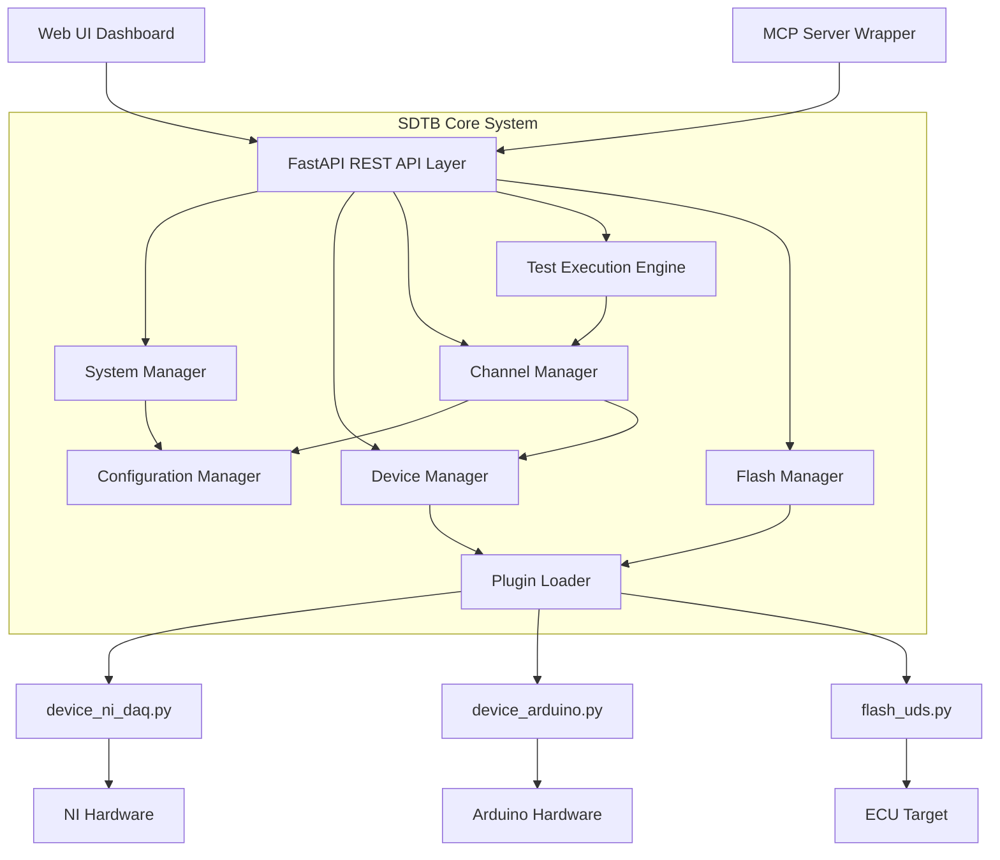
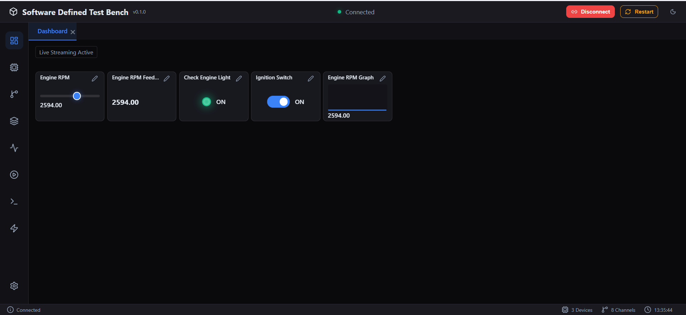
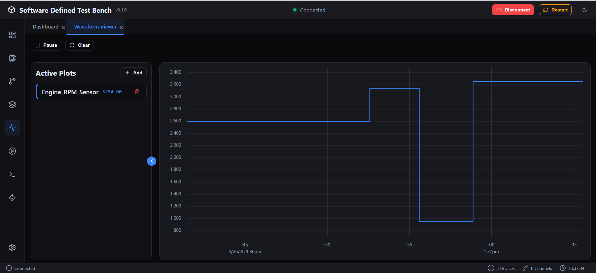
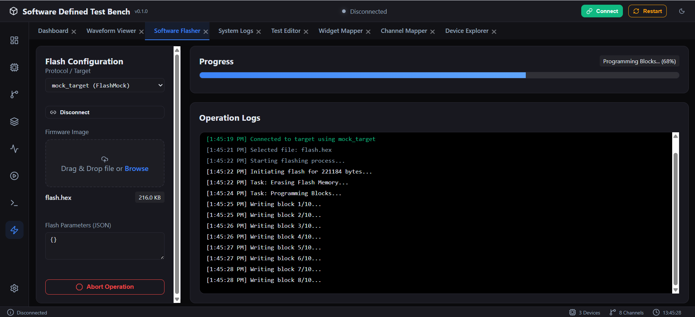
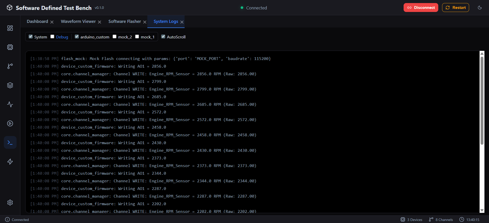

# Software Defined Test Bench (SDTB)

A flexible, software-defined test automation framework for hardware validation. SDTB provides a programmable interface that abstracts hardware complexity through REST API and MCP server interfaces, enabling rapid test development and execution.

## High-Level Concept

SDTB acts as a middle layer between your test scripts and the physical hardware. It allows you to:
1.  **Abstract Hardware**: Define logical "Channels" (e.g., `Battery_Voltage`) that map to raw hardware signals (e.g., `Arduino_Pin_A0`).
2.  **Plugin Architecture**: Add support for new devices or flashing protocols by simply dropping a Python script into the `devices/` directory.
3.  **Universal Control**: Control your entire test bench via a standardized REST API or using AI-assisted tools through the Model Context Protocol (MCP).

## System Architecture



## Tool Snapshots

### Live Dashboard


### Waveform Viewer


### Software Flasher


### System Logs & Debug


## Quick Start

### 1. Installation
```bash
pip install -r requirements.txt
```

### 2. How to Run
Start the main application, which hosts both the REST API and the MCP server (via SSE):
```bash
python main.py
```
The server will start on `http://localhost:8000`. You can access the UI at `http://localhost:8000/ui`.

## Documentation Map

| Document | Description |
|----------|-------------|
| [api.md](docs/api.md) | Detailed REST API reference and input definitions |
| [spec.md](docs/spec.md) | System specifications and protocol definitions |
| [design.md](docs/design.md) | Architectural design and implementation details |
| [AGENTS.md](AGENTS.md) | Guide for AI agents and agentic automation |

## MCP Integration

SDTB includes a built-in **Model Context Protocol (MCP)** server. This allows AI assistants (like Claude) to directly interact with your hardware bench using natural language.

### Available Tools
- `list_channels`: Discover all available sensors and actuators.
- `read_channel`: Fetch the current value of a specific signal.
- `write_channel`: Command a specific value to an output.
- `connect_system` / `disconnect_system`: Manage the hardware lifecycle.
- `get_system_summary`: Get an overview of bench health and connected devices.

### Sample Client Configuration
To connect SDTB to **Claude Desktop**, add the following to your `claude_desktop_config.json`:

```json
{
  "mcpServers": {
    "sdtb": {
      "url": "http://localhost:8000/mcp/sse"
    }
  }
}
```

*Note: The SDTB server (`python main.py`) must be running for the MCP connection to work.*

## Extending the Bench

SDTB is designed for extensibility. You can add support for new hardware or custom flashing protocols by implementing specialized Python plugins.

### How to Add a Device
To integrate new hardware (e.g., a DAQ card, Programmable Power Supply), follow these steps:

1.  **Create Plugin**: Create a new file `devices/device_<name>.py`.
2.  **Inherit from `BaseDevice`**: Your class must implement the `core.base_device.BaseDevice` interface:
    - `connect(connection_params: dict)`: Initialize the hardware communication (e.g., serial, TCP, USB).
    - `disconnect()`: Safely release hardware resources.
    - `get_signals() -> List[SignalDefinition]`: Define the I/O points available on this device (Analog Inputs, Digital Outputs, etc.).
    - `read_signal(signal_id: str)`: Logic to fetch a value from the physical signal.
    - `write_signal(signal_id: str, value: Any)`: Logic to drive the physical hardware.
    - `update()`: (Optional) A hook called every 100ms for background maintenance or heartbeats.
3.  **Define Config**: Create a JSON configuration (e.g., `devices/device_<name>.json`) specifying the plugin name and connection parameters.

### How to Add a Flash Protocol
To add a new way to flash firmware (e.g., UDS over CAN, JTAG, Bootloader over Serial):

1.  **Create Plugin**: Create a new file `devices/flash_<name>.py`.
2.  **Inherit from `BaseFlash`**: Your class must implement the `core.base_flash.BaseFlash` interface:
    - `flash(data: bytes, params: dict) -> str`: This method should initiate the flashing process and immediately return a unique `execution_id`. It must be non-blocking (e.g., start a background thread).
    - `get_status(execution_id: str) -> dict`: Return a dictionary containing the current state (e.g., "Programming", "Success") and numeric `progress` (0 to 100).
    - `get_log(execution_id: str) -> List[str]`: Return a list of detailed log strings for the UI debug view.
    - `abort(execution_id: str)`: Logic to stop an ongoing flashing operation safely.
3.  **Define Config**: Create a JSON file in the `devices/` directory (matching the `flash_*.py` pattern) that registers the plugin with the system.

### Configuration and Data Flow
Each plugin is instantiated and configured using a JSON file. These files should be placed in the `devices/` directory (or the directory specified in your system settings).

#### Device Configuration Example (`devices/device_mock.json`)
```json
{
  "id": "mock_1",
  "plugin": "MockDevice",
  "enabled": true,
  "connection_params": {
    "speed": 1.0,
    "mode": "simulation"
  }
}
```
- **plugin**: Must match the Python class name defined in your `device_*.py` file.
- **connection_params**: This entire dictionary is passed as the `connection_params` argument to your class's `connect()` method.

#### Flash Configuration Example (`devices/flash_mock.json`)
```json
{
  "id": "mock_target",
  "plugin": "FlashMock",
  "enabled": true,
  "connection_params": {
    "target_ip": "127.0.0.1",
    "timeout": 30
  }
}
```

The `DeviceManager` and `FlashManager` automatically discover these files, load the specified plugin class, and handle the lifecycle (instantiation and connection) by passing the relevant parameters from the JSON directly into the Python class methods.

## License

This project is licensed under the MIT License - see the [LICENSE](LICENSE) file for details.