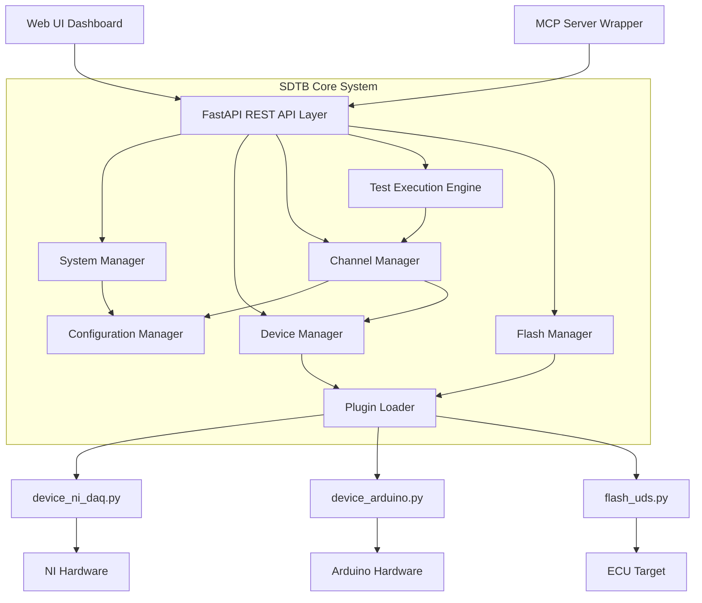

# Software Defined Test Bench (SDTB)

A flexible, software-defined test automation framework for hardware validation. SDTB provides a programmable interface that abstracts hardware complexity through REST API and MCP server interfaces, enabling rapid test development and execution.

## High-Level Concept

SDTB acts as a middle layer between your test scripts and the physical hardware. It allows you to:
1.  **Abstract Hardware**: Define logical "Channels" (e.g., `Battery_Voltage`) that map to raw hardware signals (e.g., `Arduino_Pin_A0`).
2.  **Plugin Architecture**: Add support for new devices or flashing protocols by simply dropping a Python script into the `devices/` directory.
3.  **Universal Control**: Control your entire test bench via a standardized REST API or using AI-assisted tools through the Model Context Protocol (MCP).

## System Architecture



## Tool Snapshots

### Live Dashboard


### Waveform Viewer


### Software Flasher


### System Logs & Debug


## Quick Start

### 1. Installation
```bash
pip install -r requirements.txt
```

### 2. How to Run
Start the main application, which hosts both the REST API and the MCP server (via SSE):
```bash
python main.py
```
The server will start on `http://localhost:8000`. You can access the UI at `http://localhost:8000/ui`.

## Documentation Map

| Document | Description |
|----------|-------------|
| [api.md](docs/api.md) | Detailed REST API reference and input definitions |
| [spec.md](docs/spec.md) | System specifications and protocol definitions |
| [design.md](docs/design.md) | Architectural design and implementation details |

## Extending the Bench

### How to Add a Device
1.  **Create Plugin**: Create a new file `devices/device_<name>.py`.
2.  **Implement Class**: Create a class inheriting from `core.base_device.BaseDevice`.
3.  **Define Config**: Create a corresponding `config/device_<name>.json` to enable it in the system.

### How to Add a Flash Protocol
1.  **Create Plugin**: Create a new file `devices/flash_<name>.py`.
2.  **Implement Class**: Create a class inheriting from `core.base_flash.BaseFlash`.
3.  **Define Config**: Create a JSON file `devices/flash_<name>.json` specifying the plugin class and connection parameters.

## License

[License Information]