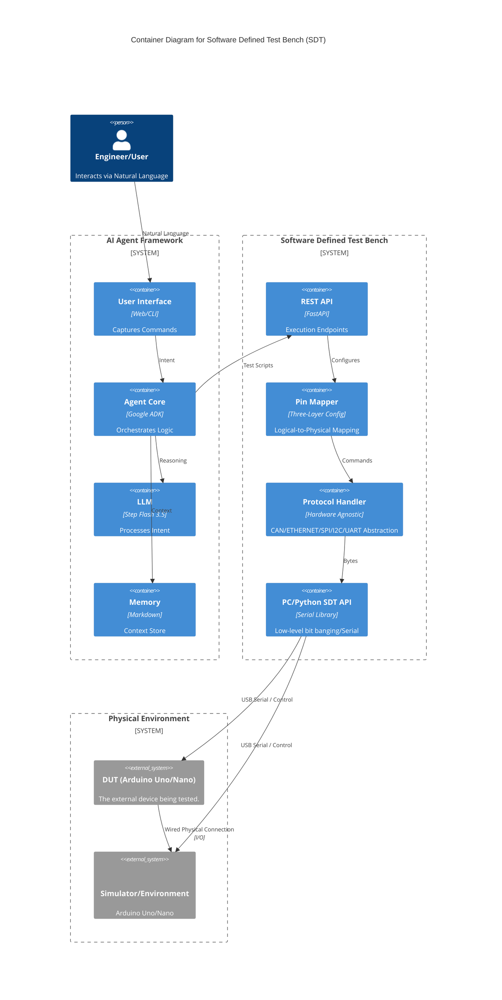

# Virtual Test Engineer - Detailed Specification

## Table of Contents
1. [System Overview](#1-system-overview)
2. [Architecture](#2-architecture)
3. [Software Defined Test Bench (SDT)](#3-software-defined-test-bench-sdt)
4. [Agent Framework](#4-agent-framework)
5. [Communication Protocol](#5-communication-protocol)
   - 5.3 [Safety & Hardware Protection](#53-safety--hardware-protection)
6. [API Design](#6-api-design)
7. [Natural Language Interface](#7-natural-language-interface)
8. [Memory System](#8-memory-system)
9. [Implementation Plan](#9-implementation-plan)
10. [Technical Stack](#10-technical-stack)
11. [Hardware Wiring](#11-hardware-wiring)
12. [Glossary](#12-glossary)
13. [Code Reference](#13-code-reference)

---

## 1. System Overview

### 1.1 Purpose
The Virtual Test Engineer is an AI-powered system that bridges the gap between natural language commands and physical hardware testing. It enables engineers to control test benches, execute tests, and analyze results using natural language prompts.

### 1.2 Core Components
1. **Software Defined Test Bench (SDT)**: Abstracts hardware under a unified software architecture
2. **Agent Framework**: AI agent that interprets natural language and controls the SDT

### 1.3 Use Case
- **DUT (Device Under Test)**: Hardware device running firmware to be tested (currently Arduino, abstracted for future hardware)
- **Signal Simulator**: Hardware device generating test signals and stimuli (currently Arduino, abstracted for future hardware)
- **Wiring**: DUT and Simulator are physically connected (e.g., DUT A0 ← Simulator D11)
- **Control**: Natural language commands to execute tests and analyze results

### 1.4 Key Features
- Hardware abstraction through software-defined interfaces
- Natural language test command interpretation
- Automated test execution and result analysis
- Hierarchical memory system for learning and improvement
- RESTful API for integration and extensibility

---

## 2. Architecture

### 2.1 High-Level Architecture



### 2.2 Component Interaction Flow

1. **User Input**: Natural language command (e.g., "Test the LED blinking function")
2. **Agent Processing**: 
   - LLM interprets the command
   - Agent retrieves relevant memory/context
   - Agent generates test plan
3. **SDT Execution**:
   - Agent calls SDT REST API
   - SDT translates to hardware commands
   - Protocol handler communicates with Arduino
4. **Result Analysis**:
   - Raw data collected from hardware
   - Agent analyzes results
   - Memory updated with learnings
5. **User Output**: Natural language response with test results

---

## 3. Software Defined Test Bench (SDT)

### 3.1 Purpose
Abstract physical hardware into software-defined interfaces, enabling:
- Hardware-agnostic test scripts (DUT and Simulator abstraction)
- Easy reconfiguration of test setups
- Centralized hardware management
- RESTful API access to all hardware functions
- Future hardware swap without code changes

### 3.2 Core Modules

#### 3.2.1 Hardware Abstraction Layer (HAL)
The HAL is the lowest software layer and the only component that speaks directly to physical hardware over USB serial. It owns the serial connection lifecycle (connect, disconnect, reconnect) and delegates all command serialization and response parsing to a `ProtocolHandler` selected at initialization based on `hardware_type`. Every module above the HAL is hardware-agnostic — swapping an Arduino for an ESP32 only requires changing the `hardware_type` in config; no upstream code changes.

> 📎 _See §13.1 [Hardware Abstraction Layer (HAL)](#code-ref-131) in the Code Reference section._

#### 3.2.2 Three-Layer Configuration System

The Pin Mapper now uses a three-layer configuration approach to separate concerns:

1. **Channel Mapping File** (`channel_mappings.json`): Maps user-friendly channel names to logical pins
2. **Simulator Configuration File** (`simulator_config.json`): Maps logical pins to physical pins with hardware limits
3. **DUT Limits File** (`dut_limits.json`): Defines acceptable ranges for each channel based on DUT specifications

```python
class PinMapper:
    """Maps user-friendly channel names to physical pins with safety validation"""
    
    def __init__(self, channel_map_file: str, simulator_config_file: str, dut_limits_file: str):
        self.channel_mappings = self._load_channel_mappings(channel_map_file)
        self.simulator_config = self._load_simulator_config(simulator_config_file)
        self.dut_limits = self._load_dut_limits(dut_limits_file)
        self._validate_configuration()
    
    def _load_channel_mappings(self, file_path: str) -> Dict
    def _load_simulator_config(self, file_path: str) -> Dict
    def _load_dut_limits(self, file_path: str) -> Dict
    def _validate_configuration(self) -> None
    
    def get_physical_pin(self, channel_name: str, device_type: str = "simulator") -> str
    def get_channel_name(self, physical_pin: str, device_type: str = "simulator") -> str
    def get_hardware_limits(self, channel_name: str) -> Dict
    def get_dut_limits(self, channel_name: str) -> Dict
    def get_effective_limits(self, channel_name: str) -> Dict  # More restrictive of hardware/DUT limits
    def validate_value(self, channel_name: str, value: float) -> bool
    def get_all_mappings(self) -> Dict
```

**Configuration Files:**

1. **Channel Mapping File** (`channel_mappings.json`):
```json
{
  "mappings": {
    "brake_temp_sensor": {
      "logical_pin": "sim_output_1",
      "description": "Brake Temperature Sensor",
      "type": "analog_input",
      "unit": "celsius"
    },
    "led_indicator": {
      "logical_pin": "sim_output_2",
      "description": "LED Indicator",
      "type": "digital_output",
      "unit": "boolean"
    },
    "button_input": {
      "logical_pin": "sim_input_1",
      "description": "Test Button",
      "type": "digital_input",
      "unit": "boolean"
    }
  }
}
```

2. **Simulator Configuration File** (`simulator_config.json`):
```json
{
  "simulator": {
    "hardware_type": "arduino_nano",
    "logical_pins": {
      "sim_output_1": {
        "physical_pin": "D11",
        "capabilities": ["analog_output", "pwm"],
        "voltage_range": [0, 5],
        "current_limit": 40,
        "resolution_bits": 8,
        "frequency_range": [0, 1000]
      },
      "sim_output_2": {
        "physical_pin": "D12",
        "capabilities": ["digital_output"],
        "voltage_range": [0, 5],
        "current_limit": 40,
        "resolution_bits": 1
      },
      "sim_input_1": {
        "physical_pin": "D2",
        "capabilities": ["digital_input", "interrupt"],
        "voltage_range": [0, 5],
        "current_limit": 1,
        "pull_up_resistor": true
      }
    }
  }
}
```

3. **DUT Limits File** (`dut_limits.json`):
```json
{
  "dut": {
    "hardware_type": "arduino_uno",
    "channels": {
      "brake_temp_sensor": {
        "physical_pin": "A0",
        "signal_type": "analog_input",
        "voltage_range": [0, 3.3],  // DUT can only tolerate 0-3.3V
        "expected_range": [0.5, 2.5],  // Normal operating range
        "resolution_bits": 10,
        "sampling_rate": 1000
      }
    }
  }
}
```

**Safety Validation Workflow:**
When setting a value for a channel:
1. Map channel name → logical pin (from channel_mappings)
2. Map logical pin → physical pin + hardware limits (from simulator_config)
3. Get DUT limits for channel (from dut_limits)
4. Calculate effective limits = more restrictive of hardware limits and DUT limits
5. Validate requested value against effective limits
6. If valid, convert value to appropriate format for hardware
7. Send command to simulator via PySerial

#### 3.2.3 Protocol Handler
The Protocol Handler defines the wire format for communicating with a specific hardware type. It is responsible for building command strings from structured parameters (`build_command`), parsing raw serial responses into dictionaries (`parse_response`), and validating that a response is well-formed (`validate_response`). `ArduinoProtocolHandler` implements the custom ASCII protocol (`RA:A0`, `OK:512`) used in the current setup. New hardware variants are supported by adding a subclass — the HAL selects the right handler automatically, keeping protocol details fully isolated from the rest of the system.

> 📎 _See §13.3 [Protocol Handlers](#code-ref-133) in the Code Reference section._

#### 3.2.4 Test Executor
The Test Executor takes a `TestDefinition` — an ordered list of steps with actions, expected values, and tolerances — and runs them sequentially against the SDT API. It handles setup and teardown steps, captures the actual value at each step, compares it against the expected value within tolerance, and aggregates the results into a `TestResult`. It is the component that turns the agent's test plan into concrete hardware interactions, and is the primary source of structured pass/fail data written back to memory.

> 📎 _See §13.4 [Test Executor](#code-ref-134) in the Code Reference section._

### 3.3 REST API Endpoints

#### 3.3.1 Hardware Control Endpoints
```
POST   /api/v1/hardware/connect
POST   /api/v1/hardware/disconnect
GET    /api/v1/hardware/status
POST   /api/v1/hardware/reset
```

#### 3.3.2 Pin Control Endpoints
```
GET    /api/v1/pins/mappings
POST   /api/v1/pins/mappings
GET    /api/v1/pins/{channel_name}/read
POST   /api/v1/pins/{channel_name}/write
GET    /api/v1/pins/{channel_name}/config
PUT    /api/v1/pins/{channel_name}/config
GET    /api/v1/pins/{channel_name}/limits
POST   /api/v1/pins/{channel_name}/validate
```

**New Endpoint Descriptions:**
- `GET /api/v1/pins/{channel_name}/limits`: Returns both hardware limits and DUT limits for a channel
- `POST /api/v1/pins/{channel_name}/validate`: Validates if a value is within safe limits for a channel
```

#### 3.3.3 Test Execution Endpoints
```
POST   /api/v1/tests/execute
GET    /api/v1/tests/{test_id}/status
GET    /api/v1/tests/{test_id}/results
POST   /api/v1/tests/sequence
GET    /api/v1/tests/history
```

#### 3.3.4 Simulator Control Endpoints
```
POST   /api/v1/simulator/connect
POST   /api/v1/simulator/disconnect
GET    /api/v1/simulator/status
POST   /api/v1/simulator/configure
POST   /api/v1/simulator/signal/generate
POST   /api/v1/simulator/signal/stop
GET    /api/v1/simulator/pins/mappings
POST   /api/v1/simulator/pins/mappings
```

### 3.4 Data Models

#### 3.4.1 Pin Configuration
> 📎 _See §13.5 [Data Models](#code-ref-135) in the Code Reference section._

#### 3.4.2 Test Definition
> 📎 _See §13.5 [Data Models](#code-ref-135) in the Code Reference section._

#### 3.4.3 Test Result
> 📎 _See §13.5 [Data Models](#code-ref-135) in the Code Reference section._

---

## 4. Agent Framework

### 4.1 Purpose
Provide an AI-powered interface that:
- Interprets natural language commands
- Generates and executes test plans
- Analyzes test results
- Learns from past interactions

### 4.2 Core Components

#### 4.2.1 Agent Core (Google ADK)
> 📎 _See §13.6 [Agent Core](#code-ref-136) in the Code Reference section._

#### 4.2.2 Tool Definitions
> 📎 _See §13.7 [SDT Tool Definitions](#code-ref-137) in the Code Reference section._

#### 4.2.3 Intent Parser
> 📎 _See §13.8 [Intent Parser](#code-ref-138) in the Code Reference section._

### 4.3 Agent Workflow

```
User Input: "Test the LED blinking function"
    │
    ▼
┌─────────────────────────────────────┐
│ 1. Intent Parsing                   │
│    - Intent: run_test               │
│    - Target: led_indicator          │
│    - Action: blink                  │
└─────────────────────────────────────┘
    │
    ▼
┌─────────────────────────────────────┐
│ 2. Memory Retrieval                 │
│    - Previous LED tests             │
│    - Known issues                   │
│    - Best practices                 │
└─────────────────────────────────────┘
    │
    ▼
┌─────────────────────────────────────┐
│ 3. Test Plan Generation             │
│    - Configure LED pin as output    │
│    - Blink sequence: ON/OFF         │
│    - Measure timing                 │
│    - Validate results               │
└─────────────────────────────────────┘
    │
    ▼
┌─────────────────────────────────────┐
│ 4. SDT API Calls                    │
│    - POST /pins/led_indicator/write │
│    - GET /pins/led_indicator/read   │
│    - POST /tests/execute            │
└─────────────────────────────────────┘
    │
    ▼
┌─────────────────────────────────────┐
│ 5. Result Analysis                  │
│    - Compare with expected          │
│    - Calculate metrics              │
│    - Generate summary               │
└─────────────────────────────────────┘
    │
    ▼
┌─────────────────────────────────────┐
│ 6. Memory Update                    │
│    - Store test results             │
│    - Tag for future reference       │
│    - Update best practices          │
└─────────────────────────────────────┘
    │
    ▼
User Output: "LED blinking test completed successfully. 
              Frequency: 1Hz, Duty cycle: 50%, 
              All timing measurements within tolerance."
```

---

## 5. Communication Protocol

### 5.1 Overview
The communication protocol is hardware-agnostic. The SDT uses PySerial to communicate with the Simulator, which in turn generates signals for the DUT. The DUT responds to these signals based on its firmware logic.

**Communication Flow:**
```
PC (Python) → PySerial → Simulator (Arduino) → Wired Connection → DUT (Arduino)
```

### 5.2 Arduino Serial Protocol (Current Implementation)

#### 5.1.1 Command Format
```
CMD:ACTION:PARAM1:PARAM2:...:PARAMn\n
```

#### 5.1.2 Response Format
```
STATUS:DATA1:DATA2:...:DATAn\n
```

#### 5.1.3 Status Codes
```
OK    - Command executed successfully
ERR   - Error occurred
TIMEOUT - Command timed busy
BUSY  - Device busy
```

#### 5.1.4 Command Set

| Command | Format | Description | Example |
|---------|--------|-------------|---------|
| READ_ANALOG | `RA:pin` | Read analog value | `RA:A0` → `OK:512` |
| READ_DIGITAL | `RD:pin` | Read digital value | `RD:D7` → `OK:1` |
| WRITE_ANALOG | `WA:pin:value` | Write analog value | `WA:D9:128` → `OK` |
| WRITE_DIGITAL | `WD:pin:value` | Write digital value | `WD:D7:1` → `OK` |
| SET_PWM | `PWM:pin:duty` | Set PWM duty cycle | `PWM:D9:50` → `OK` |
| READ_SERIAL | `RS:bytes` | Read serial data | `RS:10` → `OK:data` |
| WRITE_SERIAL | `WS:data` | Write serial data | `WS:Hello` → `OK` |
| PING | `PING` | Connection test | `PING` → `OK:PONG` |
| STATUS | `STATUS` | Get device status | `STATUS` → `OK:READY` |

### 5.2 Error Handling

#### 5.2.1 Timeout Handling
> 📎 _See §13.10 [Protocol Error Handling](#code-ref-1310) in the Code Reference section._

### 5.3 Safety & Hardware Protection

Hardware safety is enforced at **three independent layers**: the Protocol Handler (lowest, closest to the wire), the SDT API (middleware), and the Agent (highest, intent-level). A command must pass all three layers before reaching hardware. No single layer is trusted to be sufficient on its own.

```
Agent Layer         → Intent validation, confirmation gates, agent safety rules
     │
SDT API Layer       → Value range enforcement, pin-mode guards, request queuing
     │
Protocol Handler    → Command whitelisting, hardware watchdog, E-stop enforcement
     │
Hardware (Arduino)
```

---

#### 5.3.1 Voltage & Value Range Enforcement

Every channel has a defined `min_value` and `max_value` in its `PinConfig`. The SDT enforces these bounds on every write before the command is serialized and sent.

> 📎 _See §13.11 [Safety Guard](#code-ref-1311) in the Code Reference section._

**Absolute hardware limits for the current Arduino setup:**

| Constraint | Limit | Enforcement |
|------------|-------|-------------|
| Analog input voltage | 0 – 5V (0 – 1023 raw) | `min_value=0`, `max_value=1023` in PinConfig |
| Analog output (PWM duty) | 0 – 255 | `min_value=0`, `max_value=255` in PinConfig |
| Digital output | 0 or 1 only | Type validation in `validate_write` |
| Max sustained current per pin | 40mA | Documented constraint; not software-enforceable |

---

#### 5.3.2 Hardware Mutex & Request Queuing

The serial port to each Arduino is a single shared resource. Concurrent writes produce corrupted commands and undefined hardware behavior. All hardware access is serialized through a per-device mutex.

> 📎 _See §13.12 [Hardware Mutex](#code-ref-1312) in the Code Reference section._

**Rules:**
- Each physical device (DUT, Simulator) has its own independent lock. Commands to DUT and Simulator can run concurrently with each other but not within the same device.
- The agent must never issue parallel tool calls targeting the same device. Google ADK tool calls to the same hardware channel are serialized before dispatch.
- Lock acquisition timeout defaults to **2 seconds**. After timeout, the command is rejected with `HardwareBusyError` — it is never silently dropped.

---

#### 5.3.3 Emergency Stop (E-Stop)

The E-Stop mechanism immediately halts all ongoing hardware activity and drives all output pins to a known safe state. It can be triggered by the user, by the agent autonomously, or by the watchdog.

> 📎 _See §13.13 [Emergency Stop (E-Stop)](#code-ref-1313) in the Code Reference section._

**E-Stop triggers:**
| Trigger | Source | Action |
|---------|--------|--------|
| User types "stop", "halt", "emergency stop" | Agent NL interface | `trigger("User command")` |
| Test timeout exceeds 3× expected duration | TestExecutor watchdog | `trigger("Test timeout exceeded")` |
| Hardware returns 3 consecutive `ERR` responses | Protocol handler | `trigger("Hardware error storm")` |
| DUT disconnection detected mid-test | Connection monitor | `trigger("DUT disconnected")` |
| Agent detects a dangerous intended action | Agent safety rule | `trigger("Agent safety gate")` |

---

#### 5.3.4 Disconnection Detection & Mid-Test Recovery

Hardware disconnections (USB cable pulled, Arduino reset, power loss) must be detected promptly and handled gracefully rather than hanging indefinitely.

> 📎 _See §13.14 [Connection Monitor](#code-ref-1314) in the Code Reference section._

**Mid-test recovery behavior:**

| Scenario | Detection | Action |
|----------|-----------|--------|
| DUT disconnects during read | `ProtocolTimeout` on serial read | Abort test, trigger E-Stop, report `status: error` with `reason: dut_disconnected` |
| DUT disconnects during write | `ProtocolTimeout` or `ERR` response | Abort test, trigger E-Stop — do not retry writes (state is unknown) |
| Simulator disconnects | `ConnectionMonitor` missed pings | Abort test, trigger E-Stop, mark all pending test steps as `status: aborted` |
| DUT reconnects after disconnect | Operator manually clears E-Stop | Full re-PING handshake required before any new commands accepted |

**The system never assumes hardware state after a disconnection.** On reconnect, the operator must explicitly re-initialize and re-confirm pin mappings before the agent is permitted to run new tests.

---

#### 5.3.5 Agent-Level Safety Gates

Beyond hardware-layer enforcement, the agent applies intent-level safety rules before generating any hardware write plan.

**Confirmation gate:** The agent must ask for user confirmation before any destructive or irreversible action:
- Writing to any output pin not previously written in this session
- Generating a signal above 3.3V on a channel that has not been explicitly configured for 5V tolerance
- Running a test sequence longer than 30 seconds
- Triggering a hardware reset

**Dangerous intent detection:** The agent will refuse and explain rather than execute if it detects:
- A command that would write to a pin currently configured as an input (e.g., "set the temperature sensor to 100°C")
- A value that would exceed documented hardware limits even if within configured `max_value`
- Any command issued while E-Stop is active

> 📎 _See §13.15 [Agent Safety Rules](#code-ref-1315) in the Code Reference section._

---

## 11. Hardware Wiring

### 11.1 Current Setup
```
┌─────────────────────────────────────────────────────────────┐
│                    Physical Wiring                            │
│                                                              │
│  ┌──────────────┐                      ┌──────────────┐     │
│  │     DUT      │                      │  Simulator   │     │
│  │  (Arduino)   │                      │  (Arduino)   │     │
│  │              │                      │              │     │
│  │         A0 ◄─┼──────────────────────┼─ D11         │     │
│  │              │                      │              │     │
│  └──────────────┘                      └──────────────┘     │
│         │                                     │              │
│         │ USB                                 │ USB          │
│         ▼                                     ▼              │
│  ┌──────────────────────────────────────────────────────┐   │
│  │                    PC (Python)                        │   │
│  │  ┌─────────────┐              ┌─────────────┐        │   │
│  │  │  SDT API    │              │  Simulator  │        │   │
│  │  │  (FastAPI)  │◄────────────►│  Controller │        │   │
│  │  └─────────────┘              └─────────────┘        │   │
│  └──────────────────────────────────────────────────────┘   │
└─────────────────────────────────────────────────────────────┘
```

### 11.2 Signal Flow
1. **PC → Simulator**: Python script sends command via PySerial to Simulator
2. **Simulator → DUT**: Simulator generates analog/digital signal on D11
3. **DUT → Simulator**: DUT reads signal on A0 and responds based on firmware
4. **Simulator → PC**: Simulator sends response back to PC via PySerial

### 11.3 Example: Analog Signal Test
```
PC Command: "Generate 2.5V on Simulator D11"
    ↓
Simulator: Sets D11 to analog output, value 512 (2.5V)
    ↓
DUT: Reads A0, gets 512 (2.5V)
    ↓
DUT: Processes value according to firmware logic
    ↓
Simulator: Reads DUT response (if wired)
    ↓
PC: Receives confirmation and DUT response
```

### 11.4 Hardware Abstraction Benefits
- **Current**: Arduino DUT + Arduino Simulator
- **Future**: ESP32 DUT + Arduino Simulator, or Arduino DUT + Custom Signal Generator
- **No Code Changes**: Only configuration file needs to update
- **Protocol Handlers**: Different hardware uses appropriate protocol handler

### 11.5 Configuration Example (Three-Layer Approach)

With the three-layer configuration system, you now have three separate configuration files:

1. **Channel Mapping File** (`channel_mappings.json`):
```json
{
  "mappings": {
    "brake_temp_sensor": {
      "logical_pin": "sim_output_1",
      "description": "Brake Temperature Sensor",
      "type": "analog_input",
      "unit": "celsius"
    },
    "led_indicator": {
      "logical_pin": "sim_output_2",
      "description": "LED Indicator",
      "type": "digital_output",
      "unit": "boolean"
    },
    "button_input": {
      "logical_pin": "sim_input_1",
      "description": "Test Button",
      "type": "digital_input",
      "unit": "boolean"
    }
  }
}
```

2. **Simulator Configuration File** (`simulator_config.json`):
```json
{
  "simulator": {
    "hardware_type": "arduino_nano",
    "logical_pins": {
      "sim_output_1": {
        "physical_pin": "D11",
        "capabilities": ["analog_output", "pwm"],
        "voltage_range": [0, 5],
        "current_limit": 40,
        "resolution_bits": 8,
        "frequency_range": [0, 1000]
      },
      "sim_output_2": {
        "physical_pin": "D12",
        "capabilities": ["digital_output"],
        "voltage_range": [0, 5],
        "current_limit": 40,
        "resolution_bits": 1
      },
      "sim_input_1": {
        "physical_pin": "D2",
        "capabilities": ["digital_input", "interrupt"],
        "voltage_range": [0, 5],
        "current_limit": 1,
        "pull_up_resistor": true
      }
    }
  }
}
```

3. **DUT Limits File** (`dut_limits.json`):
```json
{
  "dut": {
    "hardware_type": "arduino_uno",
    "channels": {
      "brake_temp_sensor": {
        "physical_pin": "A0",
        "signal_type": "analog_input",
        "voltage_range": [0, 3.3],  // DUT can only tolerate 0-3.3V
        "expected_range": [0.5, 2.5],  // Normal operating range
        "resolution_bits": 10,
        "sampling_rate": 1000
      }
    }
  }
}
```

## 6. API Design

### 6.1 API Specification (OpenAPI 3.0)

```yaml
openapi: 3.0.0
info:
  title: Virtual Test Engineer API
  version: 1.0.0
  description: REST API for Software Defined Test Bench

servers:
  - url: http://localhost:8000/api/v1
    description: Local development server

paths:
  /hardware/connect:
    post:
      summary: Connect to hardware
      requestBody:
        required: true
        content:
          application/json:
            schema:
              type: object
              properties:
                port:
                  type: string
                  example: "COM3"
                baudrate:
                  type: integer
                  example: 9600
      responses:
        '200':
          description: Connected successfully
        '400':
          description: Connection failed

  /pins/{channel_name}/read:
    get:
      summary: Read value from pin
      parameters:
        - name: channel_name
          in: path
          required: true
          schema:
            type: string
      responses:
        '200':
          description: Pin value
          content:
            application/json:
              schema:
                type: object
                properties:
                  channel_name:
                    type: string
                  value:
                    type: number
                  unit:
                    type: string
                  timestamp:
                    type: string
                    format: date-time

  /tests/execute:
    post:
      summary: Execute a test
      requestBody:
        required: true
        content:
          application/json:
            schema:
              $ref: '#/components/schemas/TestDefinition'
      responses:
        '200':
          description: Test result
          content:
            application/json:
              schema:
                $ref: '#/components/schemas/TestResult'

components:
  schemas:
    TestDefinition:
      type: object
      properties:
        test_id:
          type: string
        name:
          type: string
        steps:
          type: array
          items:
            $ref: '#/components/schemas/TestStep'
    
    TestStep:
      type: object
      properties:
        action:
          type: string
          enum: [read, write, wait, assert]
        channel_name:
          type: string
        value:
          type: number
        expected:
          type: number
        tolerance:
          type: number
    
    TestResult:
      type: object
      properties:
        test_id:
          type: string
        status:
          type: string
          enum: [pass, fail, error, timeout]
        summary:
          type: string
        metrics:
          type: object
```

### 6.2 Authentication & Security
- API key authentication for production
- Rate limiting to prevent abuse
- Input validation and sanitization
- CORS configuration for web interfaces
- HTTPS support for secure communication

---

## 7. Natural Language Interface

### 7.1 Supported Command Patterns

#### 7.1.1 Basic Commands
```
"Read the brake temperature sensor"
"Turn on the LED"
"Set the PWM to 50%"
"Get hardware status"
"Connect to Arduino on COM3"
```

#### 7.1.2 Test Commands
```
"Test the LED blinking function"
"Run a full regression test"
"Validate the button input"
"Check if the sensor is working"
"Measure voltage on pin A0"
```

#### 7.1.3 Analysis Commands
```
"Analyze the last test results"
"What went wrong with the LED test?"
"Show me the test history"
"Compare current results with baseline"
```

#### 7.1.4 Configuration Commands
```
"Configure pin A0 as brake temperature sensor"
"Set the LED pin to D7"
"Update the sensor calibration"
"Change the test timeout to 5 seconds"
```

### 7.2 Intent Recognition

#### 7.2.1 Intent Categories
> 📎 _See §13.8 [Intent Parser](#code-ref-138) in the Code Reference section._

#### 7.2.2 Parameter Extraction
> 📎 _See §13.8 [Intent Parser](#code-ref-138) in the Code Reference section._

### 7.3 Response Generation

#### 7.3.1 Response Templates
> 📎 _See §13.9 [Response Generator](#code-ref-139) in the Code Reference section._

#### 7.3.2 Context-Aware Responses
> 📎 _See §13.9 [Response Generator](#code-ref-139) in the Code Reference section._

---

## 8. Memory System

### 8.1 Design Philosophy

The core challenge is **context window budget**: LLMs have finite context, and loading all memory files into every prompt is not feasible. The solution is a **two-tier memory architecture**:

1. **Tier 1 — Index (always loaded)**: A lightweight `index.md` the agent reads at startup. Gives a high-level map of all knowledge without loading details.
2. **Tier 2 — Memory Files (loaded on demand)**: Individual markdown files the agent fetches only when relevant, using the index as a guide.

Every conversation is summarized and written back into this structure automatically, making the system self-improving over time.

---

### 8.2 Memory Directory Structure

```
memory/
├── index.md                        ← Always loaded; maps all knowledge
├── global/
│   ├── hardware_specs.md
│   ├── best_practices.md
│   └── common_issues.md
├── sessions/
│   ├── 2024_03_28_001.md
│   ├── 2024_03_28_002.md
│   └── ...
├── tests/
│   ├── led_blink.md
│   ├── brake_temp_sensor.md
│   └── button_input.md
└── learnings/
    ├── troubleshooting.md
    ├── calibration.md
    └── timing_patterns.md
```

---

### 8.3 The Memory Index (`index.md`)

The index is the **only file always injected** into the agent's context at the start of every interaction. It is compact by design — one row per memory file.

#### 8.3.1 Index Format

```markdown
# Memory Index
_Last updated: 2024-03-28 15:00:00_

| Topic | Filename | Tags |
|-------|----------|------|
| Hardware specs and wiring for current test bench | global/hardware_specs.md | #hardware #arduino #wiring #config |
| Best practices for test design and execution | global/best_practices.md | #best-practice #testing #reliability |
| Known hardware issues and workarounds | global/common_issues.md | #bug #issue #workaround #hardware |
| LED blink test — results, timing, learnings | tests/led_blink.md | #led #blink #timing #pass |
| Brake temp sensor — calibration, read results | tests/brake_temp_sensor.md | #sensor #temperature #analog #calibration |
| Button input — debounce findings | tests/button_input.md | #button #digital #debounce |
| Troubleshooting guide — serial timeouts, resets | learnings/troubleshooting.md | #timeout #serial #error #reset |
| Session 2024-03-28 AM — LED + sensor tests | sessions/2024_03_28_001.md | #session #led #sensor #pass |
| Session 2024-03-28 PM — Button validation | sessions/2024_03_28_002.md | #session #button #fail #debug |
```

**Rules for the index:**
- Maximum **one line per memory file** — no multi-line entries.
- Topics must be **plain English summaries** (not filenames).
- Tags must use `#kebab-case` and reflect the actionable content, not just the file category.
- The agent updates this file every time a new memory file is created or significantly updated.

---

### 8.4 Memory File Format

Each memory file is a focused markdown document. There is no strict template — the agent writes content appropriate for that file's purpose. However, all files follow these conventions:

```markdown
# [Human-readable title]
_Created: YYYY-MM-DD HH:MM | Updated: YYYY-MM-DD HH:MM_
_Tags: #tag1 #tag2 #tag3_

[Content body — specific to file type]
```

#### 8.4.1 Session File (auto-generated after every conversation)

```markdown
# Session: 2024-03-28 14:30 — LED Blink & Sensor Test
_Created: 2024-03-28 15:02 | Updated: 2024-03-28 15:02_
_Tags: #session #led #sensor #pass #timing_

## Summary
Two tests run. LED blink validated at 1Hz. Brake temp sensor read correctly at 23.5°C. No failures.

## Interactions

### Test LED Blinking
- **Command**: "Test the LED blinking function"
- **Result**: ✅ PASS — 1.02Hz, 49.8% duty cycle, ±2ms variance
- **Learning**: PWM accuracy is consistent; no drift observed

### Read Brake Temperature
- **Command**: "Read the brake temperature sensor"
- **Result**: 23.5°C — within expected range
- **Learning**: Calibration offset is stable

## Stats
- Commands: 2 | Tests: 1 | Pass: 1 | Fail: 0
```

#### 8.4.2 Test File (per test type, updated with each new run)

```markdown
# Test: LED Blink
_Created: 2024-03-20 | Updated: 2024-03-28_
_Tags: #led #blink #timing #digital-output_

## Overview
Tests LED_INDICATOR (D7) blink at 1Hz with 50% duty cycle.

## Run History
| Date | Result | Frequency | Duty Cycle | Notes |
|------|--------|-----------|------------|-------|
| 2024-03-28 | ✅ PASS | 1.02Hz | 49.8% | Normal conditions |
| 2024-03-25 | ✅ PASS | 1.00Hz | 50.1% | After firmware update |
| 2024-03-20 | ❌ FAIL | 0.90Hz | 48.0% | Old firmware, timing bug |

## Learnings
- Timing variance <5ms is acceptable
- Firmware v1.2+ fixes the 0.9Hz drift bug
- Always run 5 cycles minimum for reliable average
```

#### 8.4.3 Global File (curated, long-lived knowledge)

```markdown
# Best Practices
_Created: 2024-03-01 | Updated: 2024-03-28_
_Tags: #best-practice #testing #reliability #setup_

## Test Execution
- Always PING hardware before running a test sequence
- Run setup teardown even on test failure to reset hardware state
- Use a minimum of 3 measurement samples for analog reads

## Hardware Safety
- Never exceed 5V on analog inputs — DUT max is 5V
- Reset Simulator between independent test runs

## Learnings from Sessions
- Serial timeouts spike when PC USB hub is under load — use direct USB
- Debounce delay of 20ms is required for button_input reliability
```

---

### 8.5 Memory Lifecycle

```
┌──────────────────────────────────────────────────────────────┐
│                   Agent Startup                               │
│  1. Load index.md → high-level map of all memory             │
│  2. Identify relevant files from index based on user query   │
│  3. Load only those files into context (lazy loading)        │
└──────────────────────────────────────────────────────────────┘
                        │
                        ▼
┌──────────────────────────────────────────────────────────────┐
│                  During Conversation                          │
│  - Agent may request additional files mid-conversation       │
│  - New learnings noted internally for end-of-session write   │
└──────────────────────────────────────────────────────────────┘
                        │
                        ▼
┌──────────────────────────────────────────────────────────────┐
│                End of Conversation (Auto)                     │
│  1. Summarize session → write sessions/YYYY_MM_DD_NNN.md     │
│  2. Append/update relevant test files with new run data      │
│  3. Promote key learnings → global/ files if broadly useful  │
│  4. Update index.md with any new or modified file entries    │
└──────────────────────────────────────────────────────────────┘
```

---

### 8.6 Implementation

#### 8.6.1 Memory Manager

> 📎 _See §13.16 [Memory Manager](#code-ref-1316) in the Code Reference section._

#### 8.6.2 Data Models

> 📎 _See §13.17 [Memory Data Models](#code-ref-1317) in the Code Reference section._

#### 8.6.3 Agent Integration

The agent uses `MemoryManager` in two phases per conversation:

**Phase 1 — Startup (before first user message is processed)**
> 📎 _See §13.18 [Agent Memory Integration](#code-ref-1318) in the Code Reference section._

**Phase 2 — On each user message (lazy load)**
> 📎 _See §13.18 [Agent Memory Integration](#code-ref-1318) in the Code Reference section._

**Phase 3 — End of conversation (auto-write)**
> 📎 _See §13.18 [Agent Memory Integration](#code-ref-1318) in the Code Reference section._

---

### 8.7 Context Budget Guidelines

| Layer | Content | Approx Tokens |
|-------|---------|---------------|
| System prompt (base) | Agent instructions, tool definitions | ~800 |
| **index.md (always)** | Full memory index table | **~300–600** |
| Lazy-loaded files (demand) | Up to 4 relevant memory files | ~1,500–3,000 |
| Conversation history | Rolling window of current session | ~1,000–2,000 |
| **Total budget used** | | **~3,600–6,400** |

This leaves comfortable headroom for the model's response on even a 8K context model, and scales well to 32K+ models.

**Rules:**
- `index.md` is always injected — keep it under 600 tokens (one row = ~15 tokens).
- Never load more than 4 memory files in a single turn.
- Each individual memory file should be kept under 800 tokens; split and cross-link if larger.
- Session summaries are written to be concise — 200–400 tokens max.

---

### 8.8 Memory Tools (Agent-Callable)

The agent exposes the following tools so it can explicitly request memory when needed:

> 📎 _See §13.19 [Memory Tools](#code-ref-1319) in the Code Reference section._

The `remember` tool is the key to user-taught memory — when a user says "remember that…" or "always do X", the agent calls this tool immediately to persist the instruction.

---

## 9. Implementation Plan

### 9.1 Phase 1: Software Defined Test Bench (Week 1-2)

#### 9.1.1 Milestone 1.1: Hardware Abstraction Layer
- [ ] Implement PySerial communication
- [ ] Create protocol handler
- [ ] Build connection management
- [ ] Add error handling and retries

#### 9.1.2 Milestone 1.2: Pin Mapper
- [ ] Design configuration schema
- [ ] Implement pin mapping logic
- [ ] Create configuration file parser
- [ ] Add validation and error checking

#### 9.1.3 Milestone 1.3: REST API
- [ ] Set up FastAPI project
- [ ] Implement hardware control endpoints
- [ ] Implement pin control endpoints
- [ ] Add API documentation (Swagger)

#### 9.1.4 Milestone 1.4: Test Executor
- [ ] Design test definition schema
- [ ] Implement test execution engine
- [ ] Add result validation
- [ ] Create report generation

### 9.2 Phase 2: Agent Framework (Week 3-4)

#### 9.2.1 Milestone 2.1: Agent Core
- [ ] Set up Google ADK
- [ ] Integrate Step Flash 3.5 model
- [ ] Implement basic agent loop
- [ ] Add tool registration

#### 9.2.2 Milestone 2.2: Intent Parser
- [ ] Design intent taxonomy
- [ ] Implement intent recognition
- [ ] Add parameter extraction
- [ ] Create validation logic

#### 9.2.3 Milestone 2.3: Memory System
- [ ] Create initial `memory/index.md` and directory structure
- [ ] Implement `MemoryManager` with two-tier index + lazy-load
- [ ] Implement `IndexEntry` parsing and index rewrite logic
- [ ] Implement `save_session` — auto-summarize and write session file
- [ ] Implement `update_test_memory` — append run history to test files
- [ ] Implement `promote_learning` — persist broadly useful learnings to global/
- [ ] Implement `load_relevant_files` — keyword + tag scoring for lazy load
- [ ] Register `search_memory`, `recall_test`, and `remember` as agent tools
- [ ] Inject `index.md` into agent system prompt on every startup
- [ ] Add context budget guard — cap lazy-loaded files at 4 per turn

#### 9.2.4 Milestone 2.4: Response Generator
- [ ] Design response templates
- [ ] Implement context-aware responses
- [ ] Add metric formatting
- [ ] Create suggestion system

### 9.3 Phase 3: Integration & Testing (Week 5-6)

#### 9.3.1 Milestone 3.1: System Integration
- [ ] Connect agent to SDT API
- [ ] Test end-to-end workflows
- [ ] Optimize performance
- [ ] Add monitoring and logging

#### 9.3.2 Milestone 3.2: Arduino Firmware
- [ ] Develop DUT firmware
- [ ] Develop simulator firmware
- [ ] Test protocol communication
- [ ] Validate timing and reliability

#### 9.3.3 Milestone 3.3: User Testing
- [ ] Create test scenarios
- [ ] Conduct user testing
- [ ] Gather feedback
- [ ] Iterate on improvements

### 9.4 Phase 4: Documentation & Deployment (Week 7)

#### 9.4.1 Milestone 4.1: Documentation
- [ ] Write user guide
- [ ] Create API documentation
- [ ] Document architecture
- [ ] Add code comments

#### 9.4.2 Milestone 4.2: Deployment
- [ ] Create deployment scripts
- [ ] Set up CI/CD pipeline
- [ ] Configure production environment
- [ ] Deploy and monitor

---

## 10. Technical Stack

### 10.1 Software Defined Test Bench
- **Language**: Python 3.10+
- **Serial Communication**: PySerial
- **REST API**: FastAPI
- **Data Validation**: Pydantic
- **Testing**: pytest
- **Documentation**: Swagger/OpenAPI

### 10.2 Agent Framework
- **Language**: Python 3.10+
- **Agent Framework**: Google ADK (Agent Development Kit)
- **LLM Model**: Stepfun/Step Flash 3.5
- **Memory**: Markdown files with hierarchical structure
- **Vector Search**: Optional (for semantic memory retrieval)

### 10.3 Hardware
- **DUT**: Arduino Uno/Nano
- **Simulator**: Arduino Uno/Nano
- **Communication**: USB Serial (PySerial)
- **Protocol**: Custom ASCII protocol

### 10.4 Development Tools
- **Version Control**: Git
- **IDE**: VS Code
- **API Testing**: Postman/Thunder Client
- **Monitoring**: Logging + optional Grafana

---

## 11. Appendix

### 11.1 Example Workflows

#### 11.1.1 Simple Read Command
```
User: "Read the brake temperature sensor"

Agent Processing:
1. Intent: read_sensor
2. Channel: brake_temp_sensor
3. Memory: Previous readings, calibration data

SDT API Call:
GET /api/v1/pins/brake_temp_sensor/read

Response:
{
  "channel_name": "brake_temp_sensor",
  "value": 23.5,
  "unit": "celsius",
  "timestamp": "2024-03-28T14:30:00Z"
}

Agent Response:
"📊 Brake Temperature Sensor: 23.5°C"
```

#### 11.1.2 Test Execution
```
User: "Test the LED blinking function"

Agent Processing:
1. Intent: run_test
2. Test: LED blink test
3. Memory: Previous LED tests, best practices

Test Plan:
1. Configure LED pin as output
2. Turn LED ON
3. Wait 500ms
4. Turn LED OFF
5. Wait 500ms
6. Repeat 5 times
7. Measure timing
8. Validate results

SDT API Calls:
POST /api/v1/pins/led_indicator/write {"value": 1}
POST /api/v1/tests/execute {"test_id": "led_blink", ...}

Response:
{
  "test_id": "led_blink",
  "status": "pass",
  "summary": "LED blinking at 1Hz with 50% duty cycle",
  "metrics": {
    "frequency": 1.02,
    "duty_cycle": 49.8,
    "timing_variance": 2
  }
}

Agent Response:
"✅ LED blinking test completed successfully.
 Frequency: 1.02Hz (expected: 1.0Hz)
 Duty cycle: 49.8% (expected: 50%)
 All timing measurements within tolerance."
```

### 11.2 Configuration Examples

#### 11.2.1 Hardware Configuration
```json
{
  "hardware": {
    "dut": {
      "port": "COM3",
      "baudrate": 9600,
      "timeout": 1.0
    },
    "simulator": {
      "port": "COM4",
      "baudrate": 9600,
      "timeout": 1.0
    }
  },
  "api": {
    "host": "0.0.0.0",
    "port": 8000,
    "cors_origins": ["http://localhost:3000"]
  }
}
```

#### 11.2.2 Pin Mapping Configuration
```json
{
  "mappings": {
    "A0": {
      "channel_name": "brake_temp_sensor",
      "description": "Brake Temperature Sensor",
      "type": "analog_input",
      "unit": "celsius",
      "min_value": -40,
      "max_value": 125,
      "calibration": {
        "offset": 0,
        "scale": 0.1
      }
    },
    "D7": {
      "channel_name": "led_indicator",
      "description": "LED Indicator",
      "type": "digital_output",
      "unit": "boolean"
    },
    "D2": {
      "channel_name": "button_input",
      "description": "Test Button",
      "type": "digital_input",
      "unit": "boolean",
      "pull_up": true
    }
  }
}
```

### 11.3 API Usage Examples

#### 11.3.1 Connect to Hardware
```bash
curl -X POST http://localhost:8000/api/v1/hardware/connect \
  -H "Content-Type: application/json" \
  -d '{"port": "COM3", "baudrate": 9600}'
```

#### 11.3.2 Read Sensor
```bash
curl http://localhost:8000/api/v1/pins/brake_temp_sensor/read
```

#### 11.3.3 Execute Test
```bash
curl -X POST http://localhost:8000/api/v1/tests/execute \
  -H "Content-Type: application/json" \
  -d '{
    "test_id": "led_blink",
    "name": "LED Blink Test",
    "steps": [
      {"action": "write", "channel_name": "led_indicator", "value": 1},
      {"action": "wait", "value": 500},
      {"action": "write", "channel_name": "led_indicator", "value": 0},
      {"action": "wait", "value": 500}
    ]
  }'
```

---

---

## 13. Code Reference

This section is the single source of truth for all Python implementation code.
Sections throughout the spec reference classes and functions defined here rather than
embedding code inline, keeping architecture descriptions readable and code consolidated.


### 13.1 Hardware Abstraction Layer (HAL)

_Origin: §3.2.1_

Core hardware communication abstraction. `_get_protocol_handler` selects the correct protocol at init time.

```python
class HardwareAbstractionLayer:
    """Abstracts hardware communication - hardware agnostic"""
    
    def __init__(self, hardware_type: str, port: str, baudrate: int = 9600):
        self.hardware_type = hardware_type  # "arduino", "esp32", "stm32", etc.
        self.serial_connection = None
        self.port = port
        self.baudrate = baudrate
        self.protocol_handler = self._get_protocol_handler()
    
    def _get_protocol_handler(self) -> ProtocolHandler:
        """Get appropriate protocol handler for hardware type"""
        if self.hardware_type == "arduino":
            return ArduinoProtocolHandler()
        elif self.hardware_type == "esp32":
            return ESP32ProtocolHandler()
        # Add more hardware types as needed
        else:
            return GenericProtocolHandler()
    
    def connect(self) -> bool
    def disconnect(self) -> bool
    def send_command(self, command: str) -> str
    def read_response(self) -> str
    def get_hardware_type(self) -> str
```


### 13.2 Pin Mapper

_Origin: §3.2.2_

Maps physical pin identifiers to human-readable channel names used throughout the API and agent.

```python
class PinMapper:
    """Maps physical pins to user-friendly channel names"""
    
    def __init__(self, config_file: str):
        self.mappings = {}  # pin -> channel_name -> description
    
    def add_mapping(self, pin: str, channel_name: str, description: str)
    def get_pin(self, channel_name: str) -> str
    def get_channel_name(self, pin: str) -> str
    def get_all_mappings(self) -> Dict
```


### 13.3 Protocol Handlers

_Origin: §3.2.3_

Base class plus Arduino, ESP32, and Generic implementations. Add new hardware by subclassing `ProtocolHandler`.

```python
class ProtocolHandler:
    """Base class for hardware communication protocols"""
    
    def build_command(self, action: str, params: Dict) -> str
    def parse_response(self, response: str) -> Dict
    def validate_response(self, response: str) -> bool

class ArduinoProtocolHandler(ProtocolHandler):
    """Handles custom communication protocol with Arduino"""
    
    # Command Format: CMD:ACTION:PARAMS
    # Response Format: STATUS:DATA
    
    COMMANDS = {
        "READ_ANALOG": "RA:{pin}",
        "READ_DIGITAL": "RD:{pin}",
        "WRITE_ANALOG": "WA:{pin}:{value}",
        "WRITE_DIGITAL": "WD:{pin}:{value}",
        "SET_PWM": "PWM:{pin}:{duty}",
        "READ_SERIAL": "RS:{bytes}",
        "WRITE_SERIAL": "WS:{data}",
        "PING": "PING",
        "STATUS": "STATUS"
    }
    
    def build_command(self, action: str, params: Dict) -> str
    def parse_response(self, response: str) -> Dict
    def validate_response(self, response: str) -> bool

class ESP32ProtocolHandler(ProtocolHandler):
    """Protocol handler for ESP32 - can be extended"""
    # Similar structure, different protocol if needed
    pass

class GenericProtocolHandler(ProtocolHandler):
    """Generic protocol handler for unknown hardware"""
    # Fallback implementation
    pass
```


### 13.4 Test Executor

_Origin: §3.2.4_

Runs ordered test step sequences against the SDT API and collects `TestResult` objects.

```python
class TestExecutor:
    """Executes test sequences"""
    
    def run_test(self, test_definition: Dict) -> TestResult
    def run_sequence(self, tests: List[Dict]) -> List[TestResult]
    def validate_result(self, result: TestResult, expected: Dict) -> bool
    def generate_report(self, results: List[TestResult]) -> str
```


### 13.5 Data Models

_Origin: §3.4_

Pydantic models used across the API boundary: `PinConfig`, `TestStep`, `TestDefinition`, `TestResult`.

```python
class PinConfig(BaseModel):
    pin: str
    channel_name: str
    description: str
    type: Literal["analog_input", "analog_output", "digital_input", "digital_output", "pwm"]
    unit: str
    min_value: Optional[float] = None
    max_value: Optional[float] = None
    default_value: Optional[float] = None

class TestStep(BaseModel):
    action: str  # "read", "write", "wait", "assert"
    channel_name: str
    value: Optional[Any] = None
    expected: Optional[Any] = None
    tolerance: Optional[float] = None
    timeout: Optional[int] = None

class TestDefinition(BaseModel):
    test_id: str
    name: str
    description: str
    steps: List[TestStep]
    setup: Optional[List[TestStep]] = None
    teardown: Optional[List[TestStep]] = None

class TestResult(BaseModel):
    test_id: str
    status: Literal["pass", "fail", "error", "timeout"]
    start_time: datetime
    end_time: datetime
    steps: List[StepResult]
    summary: str
    metrics: Dict[str, Any]
```


### 13.6 Agent Core

_Origin: §4.2.1_

Top-level agent class built on Google ADK. Owns the model, memory, and SDT client references.

```python
class VirtualTestEngineerAgent:
    """Main agent using Google ADK"""
    
    def __init__(self, model, memory, sdt_client):
        self.model = model  # Step Flash 3.5
        self.memory = memory
        self.sdt_client = sdt_client
        self.tools = self._initialize_tools()
    
    def process_command(self, user_input: str) -> str
    def generate_test_plan(self, intent: str) -> TestPlan
    def execute_test_plan(self, plan: TestPlan) -> TestResult
    def analyze_results(self, results: TestResult) -> Analysis
    def update_memory(self, interaction: Interaction)
```


### 13.7 SDT Tool Definitions

_Origin: §4.2.2_

Tool functions registered with the agent. Each maps directly to one SDT REST API call.

```python
class SDTTools:
    """Tools available to the agent"""
    
    def read_sensor(self, channel_name: str) -> float
    def write_output(self, channel_name: str, value: Any) -> bool
    def run_test(self, test_name: str) -> TestResult
    def get_hardware_status(self) -> Dict
    def configure_pin(self, config: PinConfig) -> bool
    def generate_signal(self, signal_config: SignalConfig) -> bool
```


### 13.8 Intent Parser

_Origin: §4.2.3 & §7.2_

`IntentParser`, `INTENT_CATEGORIES` dictionary, and `ParameterExtractor` for structured NL→intent mapping.

```python
class IntentParser:
    """Parses natural language into structured intents"""
    
    INTENTS = {
        "read_sensor": "Read a value from a sensor",
        "write_output": "Write a value to an output",
        "run_test": "Execute a test sequence",
        "get_status": "Get hardware status",
        "configure": "Configure hardware settings",
        "analyze": "Analyze test results",
        "help": "Get help or documentation"
    }
    
    def parse(self, user_input: str) -> Intent
    def extract_parameters(self, intent: Intent) -> Dict
    def validate_parameters(self, params: Dict) -> bool

INTENT_CATEGORIES = {
    "hardware_control": {
        "read": ["read", "measure", "get", "check", "monitor"],
        "write": ["write", "set", "turn", "enable", "disable"],
        "configure": ["configure", "setup", "map", "assign"]
    },
    "test_execution": {
        "run_test": ["test", "run", "execute", "perform"],
        "validate": ["validate", "verify", "confirm"],
        "analyze": ["analyze", "explain", "diagnose"]
    },
    "system": {
        "status": ["status", "state", "health"],
        "help": ["help", "how", "what", "explain"],
        "history": ["history", "log", "previous"]
    }
}

class ParameterExtractor:
    """Extracts parameters from natural language"""
    
    def extract_channel_name(self, text: str) -> Optional[str]
    def extract_value(self, text: str) -> Optional[float]
    def extract_unit(self, text: str) -> Optional[str]
    def extract_test_name(self, text: str) -> Optional[str]
    def extract_time_expression(self, text: str) -> Optional[timedelta]
```


### 13.9 Response Generator

_Origin: §7.3_

`RESPONSE_TEMPLATES` string map and `ResponseGenerator` class for context-aware user-facing output.

```python
RESPONSE_TEMPLATES = {
    "test_success": "✅ {test_name} completed successfully. {summary}",
    "test_failure": "❌ {test_name} failed. {reason}",
    "read_value": "📊 {channel_name}: {value} {unit}",
    "write_success": "✓ Set {channel_name} to {value}",
    "error": "⚠️ Error: {message}",
    "help": "ℹ️ {help_text}"
}

class ResponseGenerator:
    """Generates context-aware responses"""
    
    def generate_response(self, action: str, result: Any, context: Dict) -> str
    def format_metrics(self, metrics: Dict) -> str
    def suggest_next_steps(self, result: TestResult) -> List[str]
    def explain_failure(self, failure: Failure) -> str
```


### 13.10 Protocol Error Handling

_Origin: §5.2.1_

Custom exceptions and retry logic for serial communication failures.

```python
class ProtocolTimeout(Exception):
    """Raised when command times out"""
    pass

class ProtocolError(Exception):
    """Raised when protocol error occurs"""
    pass

def send_command_with_retry(command: str, max_retries: int = 3, timeout: float = 1.0) -> str:
    """Send command with retry logic"""
    for attempt in range(max_retries):
        try:
            response = send_command(command, timeout)
            if validate_response(response):
                return response
        except ProtocolTimeout:
            if attempt == max_retries - 1:
                raise
            time.sleep(0.1 * (attempt + 1))
```


### 13.11 Safety Guard

_Origin: §5.3.1_

`SafetyGuard` enforces per-channel value range limits and pin-mode constraints on every write.

```python
class SafetyGuard:
    """Enforces value range constraints on all write operations."""

    def validate_write(self, channel_name: str, value: Any) -> None:
        """
        Raises SafetyViolationError if value is out of bounds.
        Called by the API layer before any write command is dispatched.
        """
        config = self.pin_mapper.get_config(channel_name)

        if config.min_value is not None and value < config.min_value:
            raise SafetyViolationError(
                f"Value {value} below minimum {config.min_value} for channel '{channel_name}'"
            )
        if config.max_value is not None and value > config.max_value:
            raise SafetyViolationError(
                f"Value {value} exceeds maximum {config.max_value} for channel '{channel_name}'"
            )

    def validate_pin_mode(self, channel_name: str, operation: str) -> None:
        """
        Prevents writing to input-only pins and reading from output-only pins.
        operation: 'read' | 'write'
        """
        config = self.pin_mapper.get_config(channel_name)
        if operation == "write" and config.type in ("analog_input", "digital_input"):
            raise SafetyViolationError(
                f"Cannot write to input-only channel '{channel_name}' (type: {config.type})"
            )
        if operation == "read" and config.type == "digital_output":
            # Reading back an output is allowed (for verification); log a warning only
            logger.warning(f"Reading from output channel '{channel_name}' — verify intent")

class SafetyViolationError(Exception):
    """Raised when a command would violate a hardware safety constraint."""
    pass
```


### 13.12 Hardware Mutex

_Origin: §5.3.2_

Thread-safe command dispatch via `threading.Lock`. Prevents concurrent writes to the same serial device.

```python
import threading

class HardwareAbstractionLayer:
    
    def __init__(self, hardware_type: str, port: str, baudrate: int = 9600):
        # ... existing init ...
        self._lock = threading.Lock()          # Serializes all commands to this device
        self._command_queue = queue.Queue()    # Optional: queued async dispatch

    def send_command(self, command: str, timeout: float = 1.0) -> str:
        """
        Thread-safe command dispatch. Blocks until the lock is acquired.
        Raises HardwareBusyError if lock cannot be acquired within `timeout`.
        """
        acquired = self._lock.acquire(timeout=timeout)
        if not acquired:
            raise HardwareBusyError(
                f"Hardware '{self.port}' is busy. Command queued or rejected."
            )
        try:
            return self._send_raw(command)
        finally:
            self._lock.release()

class HardwareBusyError(Exception):
    """Raised when hardware lock cannot be acquired in time."""
    pass
```


### 13.13 Emergency Stop (E-Stop)

_Origin: §5.3.3_

`EmergencyStop` drives all outputs to safe state and blocks further commands until operator reset.

```python
class EmergencyStop:
    """System-wide hardware halt."""

    SAFE_STATES = {
        "digital_output": 0,     # All digital outputs LOW
        "analog_output": 0,      # All PWM outputs to 0% duty
        "pwm": 0,
    }

    def __init__(self, hal_dut: HardwareAbstractionLayer,
                       hal_sim: HardwareAbstractionLayer,
                       pin_mapper: PinMapper):
        self.hal_dut = hal_dut
        self.hal_sim = hal_sim
        self.pin_mapper = pin_mapper
        self._estop_active = False

    def trigger(self, reason: str) -> None:
        """
        Immediately:
        1. Set _estop_active flag — all subsequent commands are rejected
        2. Drive all writable outputs to safe state
        3. Log the E-Stop event with reason and timestamp
        4. Notify agent layer so it can halt its current plan
        """
        self._estop_active = True
        logger.critical(f"E-STOP TRIGGERED: {reason}")

        for channel_name, config in self.pin_mapper.get_all_mappings().items():
            safe_value = self.SAFE_STATES.get(config.type)
            if safe_value is not None:
                try:
                    hal = self.hal_dut if config.device == "dut" else self.hal_sim
                    hal.send_command(f"WD:{config.pin}:{safe_value}", timeout=0.5)
                except Exception as e:
                    logger.error(f"E-Stop: failed to safe '{channel_name}': {e}")

    def reset(self, operator_confirmed: bool = False) -> None:
        """E-Stop can only be cleared by explicit operator confirmation."""
        if not operator_confirmed:
            raise SafetyViolationError("E-Stop reset requires explicit operator confirmation.")
        self._estop_active = False
        logger.info("E-Stop cleared by operator.")

    def is_active(self) -> bool:
        return self._estop_active
```


### 13.14 Connection Monitor

_Origin: §5.3.4_

Background ping thread that auto-triggers E-Stop after two consecutive missed pings.

```python
class ConnectionMonitor:
    """Periodically pings hardware to detect disconnection."""

    PING_INTERVAL_SECONDS = 5.0
    MAX_MISSED_PINGS = 2

    def __init__(self, hal: HardwareAbstractionLayer, estop: EmergencyStop):
        self.hal = hal
        self.estop = estop
        self._missed = 0
        self._running = False

    def start(self) -> None:
        """Start background ping thread."""
        self._running = True
        threading.Thread(target=self._ping_loop, daemon=True).start()

    def stop(self) -> None:
        self._running = False

    def _ping_loop(self) -> None:
        while self._running:
            try:
                response = self.hal.send_command("PING", timeout=1.0)
                if "PONG" in response:
                    self._missed = 0
                else:
                    self._on_missed_ping()
            except Exception:
                self._on_missed_ping()
            time.sleep(self.PING_INTERVAL_SECONDS)

    def _on_missed_ping(self) -> None:
        self._missed += 1
        logger.warning(f"Missed ping #{self._missed} on {self.hal.port}")
        if self._missed >= self.MAX_MISSED_PINGS:
            self.estop.trigger(f"Device {self.hal.port} disconnected (missed {self._missed} pings)")
```


### 13.15 Agent Safety Rules

_Origin: §5.3.5_

String constant injected into the LLM system prompt to enforce intent-level safety gates.

```python
AGENT_SAFETY_RULES = """
SAFETY RULES — follow these before executing any hardware write:

1. Never write to a channel whose PinConfig.type is analog_input or digital_input.
2. Never write a value outside the channel's min_value / max_value range.
3. If E-Stop is active, do not issue any hardware commands. Inform the user and wait for reset.
4. Before writing to a channel for the first time in a session, confirm with the user.
5. If a test plan would take longer than 30 seconds, state the estimated duration and ask to proceed.
6. If hardware returns ERR three times in a row, trigger E-Stop and report to the user immediately.
7. Never assume hardware state after any disconnection or error — always re-verify with a STATUS ping.
"""
```


### 13.16 Memory Manager

_Origin: §8.6.1_

Central memory controller: index parsing, lazy file loading, session writes, and index updates.

```python
class MemoryManager:
    """
    Central controller for all memory operations.
    Implements the two-tier index + lazy-load strategy.
    """

    def __init__(self, memory_path: str):
        self.memory_path = Path(memory_path)
        self.index: List[IndexEntry] = []
        self._load_index()

    # --- Tier 1: Index ---

    def _load_index(self) -> None:
        """Parse index.md into structured IndexEntry list. Always called at startup."""
        index_file = self.memory_path / "index.md"
        if index_file.exists():
            self.index = self._parse_index(index_file.read_text())

    def _parse_index(self, content: str) -> List[IndexEntry]:
        """Parse markdown table rows into IndexEntry objects."""
        entries = []
        for line in content.splitlines():
            if line.startswith("|") and "---" not in line and "Topic" not in line:
                parts = [p.strip() for p in line.strip("|").split("|")]
                if len(parts) == 3:
                    entries.append(IndexEntry(
                        topic=parts[0],
                        filename=parts[1],
                        tags=parts[2].split()
                    ))
        return entries

    def get_index_context(self) -> str:
        """Return the full index.md content for injection into agent system prompt."""
        return (self.memory_path / "index.md").read_text()

    # --- Tier 2: Lazy File Loading ---

    def load_relevant_files(self, query: str, max_files: int = 4) -> str:
        """
        Score all index entries against the query, load the top-N files.
        Combines keyword match on topic + tag overlap.
        """
        scored = self._score_entries(query)
        top = sorted(scored, key=lambda x: x[1], reverse=True)[:max_files]
        
        parts = []
        for entry, score in top:
            if score > 0:
                content = self._read_file(entry.filename)
                if content:
                    parts.append(f"### Memory: {entry.topic}\n{content}")
        return "\n\n".join(parts)

    def _score_entries(self, query: str) -> List[Tuple[IndexEntry, int]]:
        query_words = set(query.lower().split())
        results = []
        for entry in self.index:
            score = 0
            topic_words = set(entry.topic.lower().split())
            score += len(query_words & topic_words) * 2
            for tag in entry.tags:
                if tag.lstrip("#") in query.lower():
                    score += 3
            results.append((entry, score))
        return results

    def _read_file(self, filename: str) -> Optional[str]:
        path = self.memory_path / filename
        return path.read_text() if path.exists() else None

    # --- Write Operations ---

    def save_session(self, session: SessionMemory) -> str:
        """Summarize and persist a completed conversation session."""
        filename = self._next_session_filename()
        content = self._format_session(session)
        self._write_file(filename, content)
        self._update_index(IndexEntry(
            topic=session.summary_title,
            filename=filename,
            tags=session.tags
        ))
        return filename

    def update_test_memory(self, test_name: str, run: TestRun) -> None:
        """Append a test run to the appropriate test memory file."""
        filename = f"tests/{self._slugify(test_name)}.md"
        existing = self._read_file(filename) or self._new_test_file(test_name)
        updated = self._append_test_run(existing, run)
        self._write_file(filename, updated)
        self._update_index(IndexEntry(
            topic=f"{test_name} — results and learnings",
            filename=filename,
            tags=run.tags
        ))

    def promote_learning(self, learning: str, category: str, tags: List[str]) -> None:
        """Add a broadly applicable learning to a global knowledge file."""
        filename = f"global/{category}.md"
        existing = self._read_file(filename) or ""
        updated = existing + f"\n- {learning}\n"
        self._write_file(filename, updated)
        self._update_index_tags(filename, tags)

    def _update_index(self, entry: IndexEntry) -> None:
        """Add or update an entry in the index, then rewrite index.md."""
        self.index = [e for e in self.index if e.filename != entry.filename]
        self.index.append(entry)
        self._write_index()

    def _write_index(self) -> None:
        rows = "\n".join(
            f"| {e.topic} | {e.filename} | {' '.join(e.tags)} |"
            for e in self.index
        )
        header = "# Memory Index\n\n| Topic | Filename | Tags |\n|-------|----------|------|\n"
        (self.memory_path / "index.md").write_text(header + rows + "\n")
```


### 13.17 Memory Data Models

_Origin: §8.6.2_

`IndexEntry`, `SessionMemory`, and `TestRun` dataclasses used by `MemoryManager`.

```python
@dataclass
class IndexEntry:
    topic: str        # Plain English summary shown in index
    filename: str     # Relative path under memory/
    tags: List[str]   # #kebab-case tags for scoring

@dataclass
class SessionMemory:
    summary_title: str          # e.g. "LED + Sensor test — all pass"
    interactions: List[Dict]    # Each command/response/learning triple
    stats: Dict                 # commands, tests_run, pass, fail counts
    tags: List[str]

@dataclass
class TestRun:
    date: str
    result: str                 # "pass" | "fail" | "error"
    metrics: Dict[str, Any]
    notes: str
    tags: List[str]
```


### 13.18 Agent Memory Integration

_Origin: §8.6.3_

Three-phase integration: startup (inject index), per-turn (lazy load), end-of-session (auto-write).

```python
# System prompt always includes the full index
index_context = memory.get_index_context()
system_prompt = BASE_SYSTEM_PROMPT + "\n\n## Memory Index\n" + index_context

# Agent tool: fetch relevant memory before planning
relevant = memory.load_relevant_files(user_input, max_files=4)
if relevant:
    context = f"## Relevant Memory\n{relevant}"
    # Inject into this turn's context

# Called by agent after session ends
memory.save_session(session)
for test_run in session.test_runs:
    memory.update_test_memory(test_run.test_name, test_run)
for learning in session.promoted_learnings:
    memory.promote_learning(learning.text, learning.category, learning.tags)
```


### 13.19 Memory Tools

_Origin: §8.8_

Agent-callable tools: `search_memory`, `recall_test`, and `remember` for explicit memory operations.

```python
class MemoryTools:
    
    def search_memory(self, query: str) -> str:
        """Search memory index and return relevant file contents."""
        return memory_manager.load_relevant_files(query, max_files=3)
    
    def recall_test(self, test_name: str) -> str:
        """Load full history for a specific test."""
        filename = f"tests/{slugify(test_name)}.md"
        return memory_manager._read_file(filename) or "No history found."
    
    def remember(self, topic: str, content: str, tags: List[str]) -> str:
        """
        User-triggered: save a specific fact or instruction for future recall.
        Creates or updates a targeted memory file immediately.
        """
        filename = f"learnings/{slugify(topic)}.md"
        memory_manager._write_file(filename, f"# {topic}\n\n{content}\n")
        memory_manager._update_index(IndexEntry(topic, filename, tags))
        return f"Saved to memory: {filename}"
```

## 12. Glossary

| Term | Definition |
|------|------------|
| SDT | Software Defined Test Bench - abstraction layer for hardware |
| DUT | Device Under Test - the Arduino being tested |
| Simulator | Arduino generating test signals and stimuli |
| Channel Name | User-friendly name for a hardware pin (e.g., "brake_temp_sensor") |
| Intent | User's intended action parsed from natural language |
| Memory | Hierarchical markdown storage for learning and context |
| Protocol | Custom ASCII communication protocol for Arduino |
| HAL | Hardware Abstraction Layer - software interface to hardware |

---

## Document Information
- **Version**: 1.0.0
- **Date**: 2024-03-28
- **Status**: Draft
- **Author**: Virtual Test Engineer Team