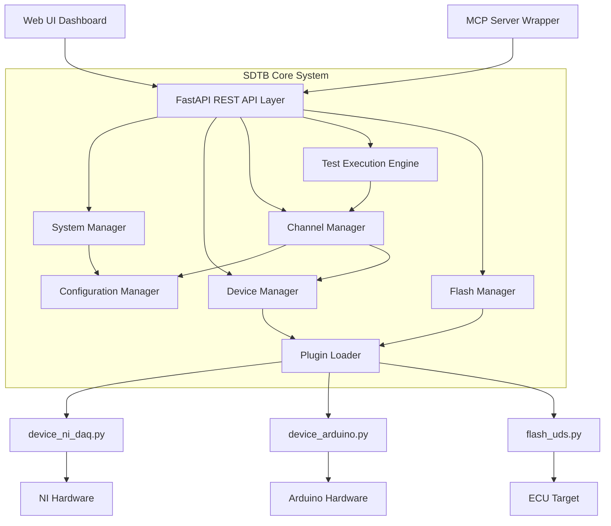
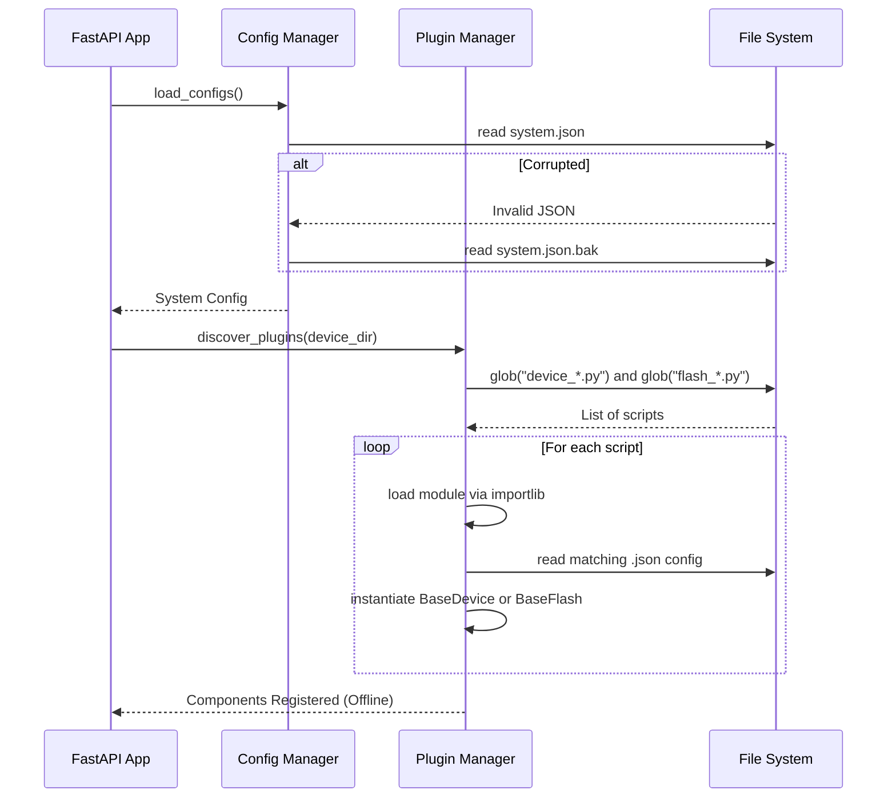
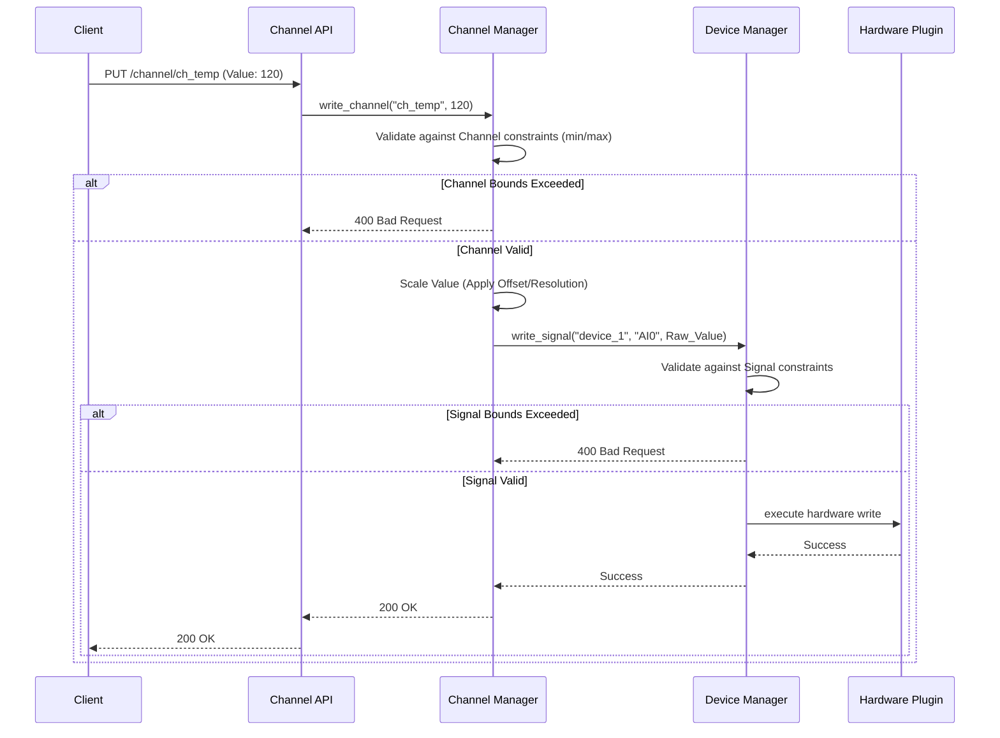
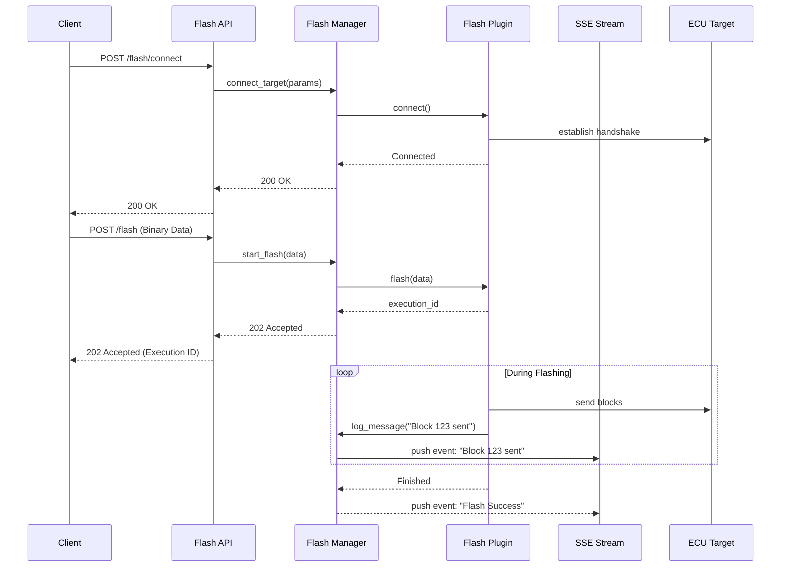

# Software Defined Test Bench (SDTB) - Detailed System Design Document

## 1. Introduction
This document outlines the detailed technical design, software architecture, and internal workflows for the Software Defined Test Bench (SDTB). The system provides a hardware-agnostic REST API and UI for controlling test hardware (Devices), abstracting physical signals into logical Channels, and orchestrating automated test sequences.

## 2. System Architecture

The SDTB follows a layered architecture designed for fault isolation, high cohesion, and hardware abstraction.



### 2.1 Technology Stack
- **Language**: Python 3.10+
- **API Framework**: FastAPI (Uvicorn server) for high-performance async routing and automatic OpenAPI documentation.
- **Validation**: Pydantic v2 for configuration schema and payload validation.
- **Frontend/UI**: Static HTML/JS/CSS served by FastAPI, utilizing Server-Sent Events (SSE) for live updates.
- **Test Scripts**: JSONL format, processed sequentially line-by-line.

## 3. Core Subsystems

### 3.1 Configuration Manager
Centralizes I/O for `system.json`, `channels.json`, and `ui.json`. 
- **Backup Strategy**: Before any write operation, copies the existing file to `<filename>.bak`.
- **Fault Recovery**: On read failure, attempts to read `.bak`. If both fail, writes a default schema and raises a warning.

### 3.2 Plugin & Device Manager
Responsible for discovering and instantiating `BaseDevice` implementations.
- Uses `importlib` and `inspect` to scan the configured device directory for `device_*.py`.
- Auto-loads corresponding `device_<name>.json` config files.
- Provides a unified `connect_all()` and `disconnect_all()` interface.
- Handles Graceful Degradation: If one device fails to connect, the system continues initializing remaining devices.
- **Enable/Disable Control**: Supports per-device software toggling (Enabled/Disabled). Disabled devices are skipped during `connect_all()` and their state is persisted in `device_<name>.json`.
- **Restart Interface**: Provides a standard way to reboot individual hardware components. Triggering a restart cycles the device connection (Disconnect -> Delay -> Connect) to re-initialize hardware bootloaders or firmware states.

### 3.3 Channel Abstraction Layer
The translation engine between user space (Channels) and hardware space (Signals).
- Validates properties independently (Channel constraints vs. Signal constraints).
- Implements the Strategy pattern via Pydantic models for physical unit conversion. Available converters include:
  - **LinearConverter**: `Target = (Raw * Resolution) + Offset`
  - **PolynomialConverter**: `Target = c0 + c1*Raw + c2*Raw^2 + ...`
  - **LUTConverter**: 1D Lookup Table with linear interpolation.

### 3.4 Test Execution Engine
An asynchronous queue manager running in a background task.
- Parses `JSONL` scripts.
- Implements **Session Locking**: When a test is actively running, manual `PUT /channel/{id}` API calls are blocked (HTTP 409 Conflict) to prevent test interference.
- Handles assertions and logs step results.

### 3.5 Flash Manager
Manages the lifecycle of target firmware programming.
- Discovers `BaseFlash` protocol plugins (e.g., UDS, CCP).
- Manages high-speed file uploads (up to 10MB) via multipart streams.
- Provides an **SSE Log Stream** (`/flash/log`) for real-time protocol diagnostics during programming.
- Handles target connection state independent of standard test bench devices.

## 4. Internal Workflows and Sequence Diagrams

### 4.1 System Boot and Plugin Discovery Sequence


### 4.2 Dual-Layer Validation (Signal I/O)
When a user writes to a channel, the request is validated twice: once against logical limits, and once against physical limits.



### 4.3 Software Flashing Workflow
The flashing process is asynchronous and involves target connection management and live log streaming.



## 5. Data Models (Pydantic)

To enforce strict validation at the API boundary, the following core Pydantic models govern the system.

```python
from pydantic import BaseModel, Field
from typing import List, Dict, Any, Optional

class ChannelProperties(BaseModel):
    unit: str
    min: float
    max: float
    resolution: float
    offset: float
    value: float

class ChannelConfig(BaseModel):
    channel_id: str
    device_id: str
    signal_id: str
    properties: ChannelProperties

class SystemServerConfig(BaseModel):
    host: str = "0.0.0.0"
    port: int = 8000

class SystemConfig(BaseModel):
    device_directory: str
    server: SystemServerConfig

class DeviceConfig(BaseModel):
    id: str
    connection_params: Dict[str, Any]
    settings: Dict[str, Any] = {}
```

## 6. Plugin Architecture: BaseDevice

All hardware plugins must inherit from `BaseDevice` to be recognized by the system.

```python
from abc import ABC, abstractmethod
from dataclasses import dataclass
from typing import List, Any

@dataclass
class SignalDefinition:
    signal_id: str
    name: str
    type: str
    direction: str
    resolution: int
    unit: str
    offset: float
    min: float
    max: float
    value: float
    description: str

# Helper classes for rapid plugin development
class SignalAnalog(SignalDefinition): pass
class SignalPWM(SignalDefinition): pass
class SignalSwitch(SignalDefinition): pass
class SignalCurrent(SignalDefinition): pass

class BaseDevice(ABC):
    @property
    @abstractmethod
    def vendor(self) -> str: pass

    @property
    @abstractmethod
    def model(self) -> str: pass

    @property
    @abstractmethod
    def firmware_version(self) -> str: pass

    @abstractmethod
    def connect(self, connection_params: dict) -> None: pass

    @abstractmethod
    def disconnect(self) -> None: pass

    @abstractmethod
    def get_signals(self) -> List[SignalDefinition]: pass

    @abstractmethod
    def read_signal(self, signal_id: str) -> Any: pass

    @abstractmethod
    def write_signal(self, signal_id: str, value: Any) -> None: pass

    @abstractmethod
    def restart(self) -> None:
        """Restarts the hardware device."""
        pass

class BaseFlash(ABC):
    @property
    @abstractmethod
    def vendor(self) -> str: pass

    @property
    @abstractmethod
    def model(self) -> str: pass

    @abstractmethod
    def connect(self, connection_params: dict) -> None: pass

    @abstractmethod
    def disconnect(self) -> None: pass

    @abstractmethod
    def flash(self, data: bytes, params: dict) -> str:
        """Initiates flash and returns execution_id."""
        pass

    @abstractmethod
    def get_status(self, execution_id: str) -> dict:
        """Returns current status and progress (0-100)."""
        pass

    @abstractmethod
    def get_log(self, execution_id: str) -> List[str]:
        """Returns log messages for a specific execution."""
        pass

    @abstractmethod
    def abort(self, execution_id: str) -> None:
        """Aborts the ongoing flash operation."""
        pass

    @property
    @abstractmethod
    def enabled(self) -> bool: pass

    @enabled.setter
    @abstractmethod
    def enabled(self, value: bool): pass
```

## 7. Real-Time Streaming & UI Architecture

The SDTB uses Server-Sent Events (SSE) to push high-frequency data to the browser, minimizing overhead compared to WebSockets or long-polling. This is critical for the UI Dashboard.

### 7.1 SSE Endpoints
- `/system/stream`: A unified, multiplexed stream that pushes all live data events (Logs, Channel Updates, and Device Signal Updates) over a single HTTP/1.1 connection to prevent browser connection exhaustion. Events are differentiated by a JSON `type` field (`{"type": "channel", ...}`).
- `/flash/stream`: Pushes high-frequency log lines during firmware target programming.

### 7.2 UI Architecture (GoldenLayout)
The UI is built on **GoldenLayout v1.5.9**, which manages dockable panels. The entire layout state is serialized and cached in the browser's `localStorage` (`sdtb-layout-v1`).
- **Resilient Rendering**: Panels trigger `resize` events that allow components (like uPlot charts) to re-calculate dimensions dynamically.
- **Physical DOM Moving**: GoldenLayout physically moves DOM nodes across the tree; the system uses a 100ms initialization delay to ensure nodes are settled before re-binding events or icons.

### 7.3 Device Explorer View
Provides a deep-dive into the hardware layer. It utilizes a master-detail pattern:
- **Device List**: Sidebar-within-view listing all discovered `BaseDevice` instances with vendor/model/version metadata.
- **Signal Tree**: Detailed table of `SignalDefinition` objects for the selected device, including physical `description` and electrical limits.
- **Live Status**: Real-time health reporting (Online/Offline/Error) via **Glow-LED Indicators**.
- **Hardware Control**: Inline **Restart** buttons to trigger hardware reboots.

### 7.4 Dashboard & Quick Look
The Dashboard provides an "Ultra-Compact" high-density view of the system.
- **Interactive Widgets**: All waveform widgets support a **Quick Look** feature. Clicking a widget opens a modal containing a full-resolution uPlot visualization with Pause/Resume/Clear controls.

```json
{
  "layout": "dashboard",
  "widgets": [
    {
      "id": "w1",
      "type": "gauge",
      "channel": "ch_temperature_1",
      "label": "Engine Temperature",
      "position": { "row": 0, "col": 0 }
    }
  ]
}
```

## 8. Test Execution (JSONL format)

Tests are uploaded as JSON Lines (JSONL) files, making them streamable and easily parsed step-by-step.

**Example Test Payload:**
```jsonl
{"action": "write", "channel": "ch_ignition", "value": 1}
{"action": "wait", "duration_ms": 500}
{"action": "assert", "channel": "ch_engine_rpm", "condition": ">=", "value": 800}
{"action": "write", "channel": "ch_throttle", "value": 50}
```
*Note: Test scripts orchestrate logical **Channels**, never raw hardware Signals.*

### 7.4 Waveform Viewer Architecture
The Waveform Viewer is a high-performance, multi-channel visualization panel.
- **Data Acquisition**: Consumes the unified `/system/stream` and filters for relevant channel IDs.
- **Rendering**: Utilizes a canvas-based rendering engine for smooth real-time plotting of thousands of data points.
- **State Management**: Maintains a local circular buffer of signal values to support pausing, zooming, and historical scrubbing.
- **Line Styles**: Supports dynamic line rendering patterns (Solid, Dashed, Dotted, Points).
- **Interactive Layer**: Implements a gesture/mouse coordinate transformation layer to translate screen pixels into physical signal units (X: Time, Y: Value) for zooming and panning.
