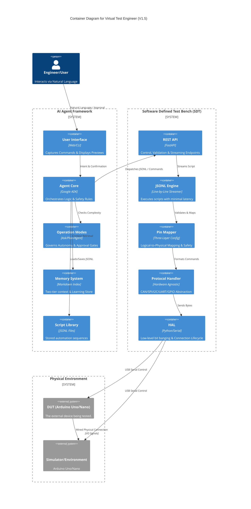
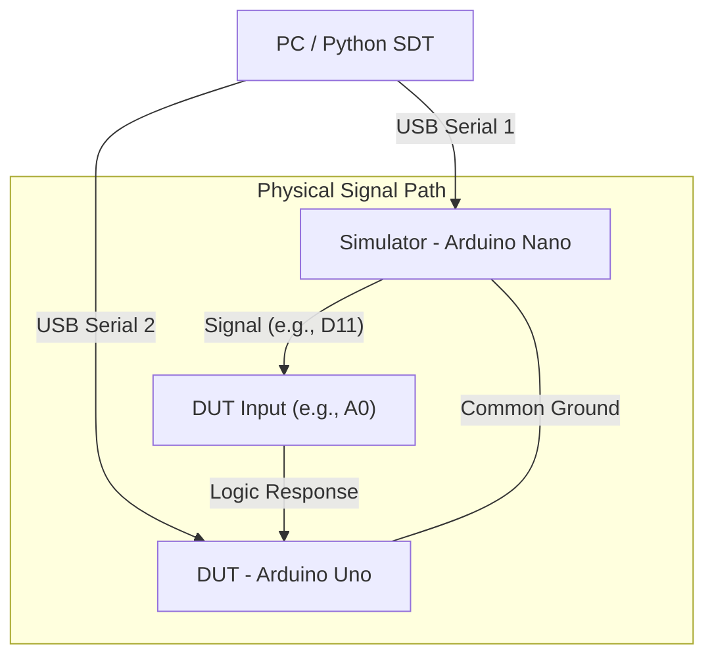

# 1. System Overview

### 1.1 Purpose
The **Virtual Test Engineer** is an AI-powered orchestration system designed to bridge the gap between high-level natural language commands and low-level physical hardware testing. It transforms an engineer's intent into executable hardware actions, enabling the control of test benches, execution of complex test sequences, and real-time analysis of results without requiring the user to write manual driver code or low-level scripts. By acting as a "co-pilot," the system reduces the cognitive load on the engineer while maintaining strict hardware safety and reliability standards.

### 1.2 Core Components
The system is built on two primary pillars:

* **Software Defined Test Bench (SDT)**: This layer abstracts physical hardware (such as Arduinos or ESP32s) into a unified, software-defined interface. It manages the hardware lifecycle, enforces safety limits, and provides a RESTful API for both single-command execution and high-speed JSONL script streaming.
* **Agent Framework**: Built using the **Google ADK (Agent Development Kit)**, this AI layer interprets natural language, retrieves historical context from memory, and generates optimized test plans. It manages the transition between operational modes (Ask, Plan, and Agent) to ensure the user is always in control of complex operations.

### 1.3 Use Case & Physical Environment
The system is optimized for a "one engineer, one desk" environment, focusing on desktop-level hardware validation.
* **Device Under Test (DUT)**: The target hardware (e.g., an Arduino Uno or Nano) running the firmware that needs validation.
* **Signal Simulator**: A secondary hardware device (e.g., an Arduino Nano) acting as the environment simulator to generate stimuli, mock loads, and test signals for the DUT.
* **Physical Wiring**: The DUT and Simulator are physically interconnected (e.g., Simulator Pin D11 connected to DUT Pin A0) to allow for closed-loop testing.
* **Control Interface**: The engineer interacts via a Natural Language interface to trigger tests like "Measure the brake sensor response to a 2.5V ramp".

### 1.4 Key Features
* **Hardware Abstraction Layer (HAL)**: Enables hardware-agnostic testing where scripts can be reused across different microcontrollers simply by updating configuration files.
* **High-Speed JSONL Scripting**: Bypasses REST API latency by streaming sequences of commands line-by-line for smooth signal generation.
* **Three-Tier Operational Modes**:
    * **Ask Mode**: For immediate, single-point data queries.
    * **Plan Mode**: For generating, reviewing, and approving complex scripts with visual ASCII previews.
    * **Agent Mode**: For fully automated execution of trusted, saved scripts.
* **Hierarchical Memory System**: Uses a two-tier index system (Markdown-based) to store hardware specs, test history, and user-taught "fix" patterns for automated troubleshooting.
* **Automated Troubleshooting**: The agent analyzes post-test telemetry to identify potential physical issues, such as loose wires or ground loops.
* **Safety-First Design**: Includes mandatory pre-validation of all scripts, a global emergency stop (E-Stop), and an automatic global teardown to return all pins to a safe state after any run.


# 2. Architecture

The Virtual Test Engineer architecture is designed for modularity, safety, and high-performance hardware interaction. It follows a layered approach that separates high-level AI reasoning from low-level bit-banging.

---

## 2.1 High-Level Architecture (C4 Diagram)

The system is divided into three primary functional layers: the **Agent Layer**, the **Software Defined Test Bench (SDT) Layer**, and the **Physical Environment**.



---

## 2.2 Layered Component Descriptions

### 2.2.1 Agent Layer (The "Brain")
* **Agent Core (Google ADK)**: The central orchestrator that uses the LLM (Step Flash 3.5) to parse user intent into actionable tool calls.
* **Operational Modes**: Manages the **Ask**, **Plan**, and **Agent** modes to determine whether a script requires a user preview or auto-execution.
* **Memory System**: Implements a two-tier Markdown architecture. The **Index** (`index.md`) is always loaded to provide a map of knowledge, while specific files are "lazy-loaded" on demand to save context tokens.
* **Script Library**: A persistent store of JSONL scripts generated during "Plan Mode." These can be "stitched" together by the agent to create complex, multi-phase test sequences.

### 2.2.2 SDT Layer (The "Nervous System")
* **FastAPI Wrapper**: Provides a standard REST interface for the agent to communicate with hardware. It includes endpoints for single-pin control and JSONL script uploading.
* **JSONL Engine**: A high-speed execution core that reads `.jsonl` files line-by-line. It dispatches commands to the `ProtocolHandler` immediately to avoid the overhead of large JSON object parsing during live signal generation.
* **Pin Mapper (3-Layer)**: Separates user-friendly channel names from physical hardware. It enforces **effective limits** by comparing the Simulator's hardware capabilities with the DUT's electrical tolerances.
* **Hardware Abstraction Layer (HAL)**: The only component aware of the physical serial port and baud rate. It uses a **Hardware Mutex** to ensure only one command is sent to a specific Arduino at a time.

### 2.2.3 Physical Layer (The "Hands")
* **Simulator**: Configured via `simulator_config.json`, this device generates the analog/digital signals required to stimulate the DUT.
* **DUT**: The target device. Its electrical limits are defined in `dut_limits.json` to prevent the agent from accidentally applying over-voltage during a test.

---

## 2.3 Component Interaction Flow (JSONL Execution)

This flow illustrates the interaction when a user requests a complex signal (e.g., a 10-step ramp) in **Plan Mode**.

1.  **Intent Capture**: User asks: "Generate a 0-5V ramp on the brake simulator".
2.  **Script Generation**: Agent Core generates a 10-line `input.jsonl` file.
3.  **Pre-Validation**: Agent sends the script to the SDT `/validate` endpoint. The Pin Mapper confirms the 5V target is within DUT and Simulator limits.
4.  **User Preview**: If validation passes, the Agent presents a **Table and ASCII Graph** of the ramp to the user.
5.  **Execution**: Upon user "Go," the Agent POSTs the JSONL to the SDT.
6.  **Streaming**: The JSONL Engine dispatches each line to the HAL. For every input line, an output line is generated in `output.jsonl` with captured hardware responses.
7.  **Teardown**: Once the last line is executed, the SDT automatically triggers `global_teardown.jsonl` to set all pins to 0V/LOW.
8.  **Summary**: The Agent parses `output.jsonl`, summarizes the results, and updates the Test Memory.

# 3. Software Defined Test Bench (SDT)

The **Software Defined Test Bench (SDT)** serves as the physical-to-digital bridge, transforming low-level hardware signals into a high-level, programmable environment. Its primary goal is to make hardware testing as flexible and iterative as software development by abstracting specific pin assignments and electrical constraints into a unified interface.

---

## 3.1 Hardware Abstraction Layer (HAL)
The HAL is the foundational software layer and the only module that communicates directly with physical hardware over USB serial. 
* **Connection Management**: It owns the entire serial lifecycle, including connection, disconnection, and automated recovery after a hardware reset.
* **Hardware Agnosticism**: Through the use of a `ProtocolHandler`, the HAL can communicate with Arduinos, ESP32s, or custom hardware without changing the upstream code.
* **Concurrency Control**: It implements a **Hardware Mutex** to ensure that only one command is dispatched to a specific serial port at a time, preventing corrupted commands or undefined hardware behavior.

---

## 3.2 Three-Layer Configuration System
The SDT utilizes a decoupled configuration strategy to ensure that hardware can be remapped or swapped with zero code changes.

### 3.2.1 Channel Mapping File (`channel_mappings.json`)
* **Purpose**: Maps user-friendly names to logical pins.
* **Content**: Defines the human-readable identifier (e.g., `brake_temp_sensor`), its logical pin (e.g., `sim_output_1`), and its unit of measurement (e.g., `celsius`).

### 3.2.2 Simulator Configuration File (`simulator_config.json`)
* **Purpose**: Maps logical pins to physical hardware pins on the Simulator.
* **Content**: Includes physical pin IDs (e.g., `D11`), capabilities (e.g., `PWM`, `Analog`), and the simulator's physical current and voltage limits.

### 3.2.3 DUT Limits File (`dut_limits.json`)
* **Purpose**: Defines the electrical safety boundaries of the Device Under Test.
* **Content**: Specifies the maximum voltage the DUT can tolerate on a specific pin (e.g., 3.3V) and the expected normal operating range for signals.

---

## 3.3 JSONL Scripting Engine
The **JSONL Engine** is a high-speed execution core designed to minimize the latency inherent in standard REST API calls.

### 3.3.1 Request Format (`input.jsonl`)
The Agent streams a sequence of JSON objects, where each line represents a discrete hardware action.
* **Example Actions**: `write`, `read`, `wait`, and `assert`.
* **Script Variables**: Supports placeholders (e.g., `$TARGET_V`) that the SDT resolves at runtime, allowing the same script to be reused with different parameters.

### 3.3.2 Response Format (`output.jsonl`)
For every line in the input script, the SDT generates a corresponding response line.
* **Telemetry**: Each line includes the execution status (`OK` or `ERROR`), the value captured from the hardware, and a high-precision timestamp.

### 3.3.3 Pre-Validation (The Safety Scan)
Before the first command of a JSONL script is executed, the SDT performs a **Dry-Run Validation**.
* **Full-Scan**: It parses the entire file to check for future violations, such as trying to write to an input pin in step #100 or exceeding a voltage limit in step #200.
* **Blocking**: If any error is found, the entire script is rejected, ensuring the hardware never enters an unsafe state.

---

## 3.4 REST API Endpoints
The SDT exposes a FastAPI interface for both real-time interaction and automated testing.

* **Hardware Control**: `POST /connect`, `POST /disconnect`, `GET /status`.
* **Pin Control**: `GET /pins/{channel}/read`, `POST /pins/{channel}/write`.
* **Script Execution**: `POST /scripts/execute` (Accepts JSONL files).
* **Validation**: `POST /scripts/validate` (Used by the Agent in **Plan Mode**).
* **Configuration Management**:
  - `GET /config/simulator_config`: Retrieves the current simulator configuration file.
  - `PUT /config/simulator_config`: Updates the simulator configuration file with new settings.
  - `GET /config/dut_config`: Retrieves the current DUT configuration file.
  - `PUT /config/dut_config`: Updates the DUT configuration file with new settings.

---

## 3.5 Global Teardown & Fail-Safe
Upon the completion of any script or the detection of a failure, the SDT automatically dispatches a **Global Teardown**.
* **Action**: Immediately drives all writable outputs to their predefined "safe state" (typically 0V or LOW).
* **Watchdog**: If the serial connection to the Simulator or DUT is lost, a hardware-level watchdog triggers the teardown to prevent orphaned signals from damaging the equipment.

# 4. Agent Framework

The **Agent Framework** is the cognitive layer of the system, responsible for translating high-level human intent into structured hardware commands while maintaining safety and learning from every interaction. Built on the **Google ADK (Agent Development Kit)** and powered by **Step Flash 3.5**, it manages the test lifecycle from initial request to final diagnostic reporting.

---

## 4.1 Purpose and Core Capabilities
The framework provides an AI-powered interface designed to:
* **Interpret Natural Language**: Translate informal engineering requests into precise test plans.
* **Orchestrate Execution**: Manage the generation and delivery of high-speed JSONL scripts to the SDT.
* **Perform Result Analysis**: Compare captured data against expected values and calculate timing metrics.
* **Self-Improvement**: Learn from hardware failures and user-provided "fixes" to automate future troubleshooting.

---

## 4.2 Agent Operation Modes
The agent operates in three distinct modes to balance engineer oversight with automated efficiency:

| Mode | Workflow Logic | Best Use Case |
| :--- | :--- | :--- |
| **Ask Mode** | User Prompt → Single SDT Query → Direct Value Response | Real-time debugging and simple pin reads (e.g., "What is the voltage on A0?"). |
| **Plan Mode** | User Prompt → JSONL Generation → **Reviewable Preview** → User "Go" → Execute | Developing new test sequences or performing high-voltage/complex operations. |
| **Agent Mode** | User Prompt → JSONL Generation → **Auto-Execute** → Detailed Result Summary | Repetitive regression testing using trusted or saved scripts. |

---

## 4.3 The Reasoning and Execution Loop
Every interaction follows a structured six-step workflow:
1.  **Intent Parsing**: Identifies target channels (e.g., `brake_sim`) and actions (e.g., `ramp`).
2.  **Memory Retrieval**: Searches the `index.md` for historical test data, pin configs, and known troubleshooting patterns.
3.  **Script Generation**: Builds an `input.jsonl` file containing the necessary `write`, `read`, and `wait` commands.
4.  **Pre-Execution Gate**: 
    * **In Plan Mode**: Presents a Table and ASCII graph preview.
    * **In Agent Mode**: Performs silent SDT pre-validation before auto-executing.
5.  **SDT Dispatch**: Streams the script to the SDT API and monitors for real-time status updates.
6.  **Analysis & Update**: Parses `output.jsonl`, summarizes performance, and writes the session log to memory.

---

## 4.4 Automated Troubleshooting and Auto-Correction
The agent acts as an intelligent safety layer, resolving minor issues autonomously while escalating major ones to the user.

### 4.4.1 Minor Auto-Correction
If a script requests a value slightly beyond hardware limits (e.g., requesting 3.35V on a 3.3V tolerance pin), the agent applies **Clamping Logic**. It automatically adjusts the value to the safe maximum and informs the user: *"Capped requested voltage to 3.3V limit"*.

### 4.4.2 Unrecoverable Error Escalation (Down-shifting)
If an error is structural—such as attempting to write to a pin configured as an input—the agent performs a **Safety Down-shift**:
1.  **Stop**: Execution is blocked immediately.
2.  **Switch**: The session switches from **Agent Mode** to **Plan Mode**.
3.  **Clarify**: The agent presents a **Multiple-Choice Fix List** (e.g., "A: Change pin mapping", "B: Adjust value", "C: Custom input").
4.  **Remember**: Once the user selects a fix, the agent stores the pattern in `learnings/auto_corrections.md` for future use.

---

## 4.5 Visualization (Reviewable Format)
For scripts exceeding 10 steps, the agent generates a visual preview to ensure the engineer can verify the signal shape at a glance.

### 4.5.1 ASCII Dual-Trace Graphs
The agent renders a simple ASCII chart showing the intended **Stimulus (Simulator Output)** and the **Expected/Actual Response (DUT Input)**.

```text
Voltage |      _____ (Sim Out: Target 3.3V)
        |     /
        |  ..-""--.. (DUT In: Response)
        +----------------------------
          0ms   250ms   500ms
```

### 4.5.2 Summary Trace View
Post-execution summaries include a compact **Sparkline** representing signal health:
* **[Sim Out]** `_--~--_`
* **[DUT In ]** `_.._.._`
* **Status**: `PASS` (Delta < 5%)

---

## 4.6 Chained Script Stitching
The agent can "stitch" multiple saved JSONL files into a single master sequence.
* **Variable Consistency**: The agent ensures placeholders like `$TARGET_V` are unified across the entire chain.
* **Sequential Review**: Before running a chain, the user receives a consolidated **Variable Table** for final approval.
* **Stop-on-Fail**: If Script A in a chain fails, the agent aborts the sequence and triggers the **Global Teardown** to ensure the bench is safe.

# 5. Communication Protocol

The communication protocol architecture is hardware-agnostic, enabling the **Virtual Test Engineer** to interface with various microcontrollers via standardized data streams. The primary communication flow moves from the PC (Python) through PySerial to the Simulator (Arduino), which then interacts with the Device Under Test (DUT) via physical wired connections.

---

## 5.1 Overview and Data Flow
* **Physical Layer**: Uses USB Serial communication (PySerial) between the PC and hardware devices.
* **Abstracted Flow**: PC (Python) → PySerial → Simulator (Arduino) → Wired Physical Connection → DUT (Arduino).
* **Hardware Independence**: The protocol is designed so that swapping an Arduino for another device (e.g., ESP32) only requires updating the specific `ProtocolHandler`.

---

## 5.2 Arduino Serial Protocol (ASCII)
The current implementation utilizes a custom ASCII-based protocol for low-level hardware control.

### 5.2.1 Message Formats
* **Command Format**: `CMD:ACTION:PARAM1:PARAM2:...:PARAMn\n`.
* **Response Format**: `STATUS:DATA1:DATA2:...:DATAn\n`.

### 5.2.2 Status Codes
* **OK**: Command executed successfully.
* **ERR**: An error occurred during execution.
* **TIMEOUT**: The command timed out.
* **BUSY**: The device is currently busy with another operation.

### 5.2.3 Standard Command Set
| Command | Format | Description | Example |
| :--- | :--- | :--- | :--- |
| **READ_ANALOG** | `RA:pin` | Reads analog value (0–1023). | `RA:A0` → `OK:512` |
| **READ_DIGITAL** | `RD:pin` | Reads digital value (0 or 1). | `RD:D7` → `OK:1` |
| **WRITE_ANALOG** | `WA:pin:value` | Writes analog (PWM) value. | `WA:D9:128` → `OK` |
| **WRITE_DIGITAL** | `WD:pin:value` | Writes digital value. | `WD:D7:1` → `OK` |
| **SET_PWM** | `PWM:pin:duty` | Sets PWM duty cycle. | `PWM:D9:50` → `OK` |
| **PING** | `PING` | Connection health check. | `PING` → `OK:PONG` |
| **STATUS** | `STATUS` | Retrieves device readiness state. | `STATUS` → `OK:READY` |

---

## 5.3 JSONL Streaming Protocol
To handle high-speed signal generation and multi-step tests, the system uses a **JSONL (JSON Lines)** streaming interface which bypasses the latency of standard REST requests.

### 5.3.1 Input Stream (`input.jsonl`)
The Agent generates a sequence of independent JSON objects.
* **Structure**: `{"action": "write", "channel": "led_indicator", "value": 1, "timestamp_offset": 0}`.
* **Actions Supported**: `write`, `read`, `wait`, and `assert`.

### 5.3.2 Output Stream (`output.jsonl`)
The SDT responds with a mirrored JSONL file for every input line.
* **Structure**: `{"step": 1, "status": "OK", "action": "write", "value_sent": 3.3, "timestamp": "10:45:00.001"}`.
* **Error Reporting**: Includes failure reasons and the specific line number where the error occurred.

---

## 5.4 Error Handling and Reliability
* **Retries**: Commands that fail due to `ProtocolTimeout` are automatically retried up to 3 times before an error is raised.
* **Missed Pings**: The `ConnectionMonitor` pings hardware every 5 seconds. If 2 consecutive pings are missed, an E-Stop is triggered.
* **Stop-on-Fail**: In chained script execution, if any script returns a `fail` or `error` status, the SDT halts the entire sequence to prevent cascading hardware issues.

---

## 5.5 Safety & Hardware Protection
Safety is enforced through a **Three-Layer Architecture**.

### 5.5.1 Layer Enforcement
1.  **Agent Layer**: Intent validation and mandatory confirmation gates.
2.  **SDT API Layer**: Value range enforcement (`min_value`/`max_value`) and pin-mode guards.
3.  **Protocol Handler**: Command whitelisting and hardware watchdog pings.

### 5.5.2 Emergency Stop (E-Stop)
An E-Stop immediately halts all ongoing hardware activity.
* **Triggers**: User "stop" commands, test timeouts, 3 consecutive `ERR` responses, or device disconnection.
* **Action**: Drives all digital and analog outputs to a safe state (0V/LOW).

### 5.5.3 Global Teardown
Every script completion or abort triggers a `global_teardown.jsonl` sequence.
* **Mandatory Reset**: Ensures all pins are reset to 0V/LOW so the test bench returns to a known "Zero State" before the next interaction.
* **No Partial Resumption**: After a failure, the hardware state is considered unknown; the entire chain must be restarted from the beginning.

# 6. API Design

The Virtual Test Engineer API is a RESTful interface built with **FastAPI**, designed to provide a high-performance bridge between the AI Agent and the physical test bench. It supports both synchronous single-command execution and asynchronous high-speed **JSONL streaming**.

---

## 6.1 API Specification (OpenAPI 3.0)

The API follows the OpenAPI 3.0 standard, ensuring compatibility with modern development tools and automated documentation via Swagger/Redoc.

```yaml
openapi: 3.0.0
info:
  title: Virtual Test Engineer API
  version: 1.5.0
  description: REST API for Software Defined Test Bench with JSONL Streaming support
servers:
  - url: http://localhost:8000/api/v1
```

---

## 6.2 Endpoint Categories

### 6.2.1 Hardware Lifecycle Endpoints
These endpoints manage the connection state of the physical microcontrollers (DUT and Simulator).

* **POST** `/hardware/connect`: Initializes the serial connection using the specified port and baud rate.
* **POST** `/hardware/disconnect`: Safely closes the serial ports.
* **GET** `/hardware/status`: Returns the current connection health and readiness state.
* **POST** `/hardware/reset`: Triggers a hardware-level reset of the connected devices.

### 6.2.2 Pin & Channel Management
These endpoints interact with the **Pin Mapper** to translate logical channel names into physical pin actions.

* **GET** `/pins/{channel_name}/read`: Captures a single value from the specified channel.
* **POST** `/pins/{channel_name}/write`: Dispatches a single value to an output channel after passing **Safety Guard** validation.
* **GET** `/pins/{channel_name}/limits`: Retrieves both hardware (Simulator) and safety (DUT) limits for the channel.
* **POST** `/pins/{channel_name}/validate`: Checks if a specific value is within the **Effective Limits** before execution.

### 6.2.3 JSONL Scripting & Execution
This category handles high-speed, multi-step test sequences while bypassing standard REST latency.

* **POST** `/scripts/validate`: Performs a **Dry-Run Validation** of an entire JSONL file.
    * **Logic**: Scans for pin-mode conflicts, out-of-range values, and sequence errors.
    * **Response**: Returns success or a detailed list of error lines for the Agent's **Error Preview**.
* **POST** `/scripts/execute`: Executes a validated JSONL script.
    * **Streaming**: Processes lines one-by-one to maintain signal timing.
    * **Reporting**: Returns a mirrored `output.jsonl` with timestamps and captured telemetry.

### 6.2.4 Simulator & Environment Control
Specifically targets the hardware acting as the stimulus source.

* **POST** `/simulator/configure`: Sets the hardware type and pin modes for the simulator.
* **POST** `/simulator/signal/generate`: Triggers continuous signal generation (e.g., PWM or constant voltage).
* **POST** `/simulator/signal/stop`: Halts all active signal generation on the simulator.

---

## 6.3 Authentication & Security

To ensure hardware safety and prevent unauthorized access, the API implements several security layers:

* **API Key Authentication**: Required for all production-level hardware interactions.
* **Input Sanitization**: All incoming JSON parameters are validated via **Pydantic** models to prevent injection or malformed command errors.
* **Rate Limiting**: Prevents the Agent or external tools from overwhelming the serial buffer.
* **Hardware Mutex**: A server-side lock ensures that concurrent API requests targeting the same physical device are queued and executed sequentially.

---

## 6.4 Error Response Format

All API errors return a structured JSON response to facilitate the Agent's **Automated Troubleshooting** logic.

```json
{
  "error": "SafetyViolationError",
  "message": "Value 6.0 exceeds DUT limit of 5.0V on channel 'brake_sim'",
  "line_number": 45,
  "remediation": ["Reduce voltage", "Adjust DUT limits file"]
}
```

# 7. Natural Language Interface

The **Natural Language Interface (NLI)** serves as the primary gateway for the engineer, leveraging the **Step Flash 3.5** model through the **Google ADK** to interpret human intent and convert it into structured hardware operations.

---

## 7.1 Supported Command Patterns
The NLI is designed to recognize a wide array of engineering requests, categorized by their functional impact on the test bench.

### 7.1.1 Basic Hardware Commands
Used for immediate interaction with specific pins or hardware states:
* "Read the brake temperature sensor".
* "Turn on the LED".
* "Set the PWM to 50%".
* "Get hardware status".
* "Connect to Arduino on COM3".

### 7.1.2 Test Execution Commands
Used to trigger multi-step sequences or formal validation routines:
* "Test the LED blinking function".
* "Run a full regression test".
* "Validate the button input".
* "Measure voltage on pin A0".

### 7.1.3 Analysis and Diagnostic Commands
Used to query test history or troubleshoot failures:
* "Analyze the last test results".
* "What went wrong with the LED test?".
* "Show me the test history".
* "Compare current results with baseline".

---

## 7.2 Intent Recognition
The Agent processes input through a specialized parsing pipeline to transform prose into parameters.

### 7.2.1 Intent Categories
The system maps requests to specific functional categories to determine the required mode and safety level:
* **Hardware Control**: Includes `read_sensor`, `write_output`, and `configure` actions.
* **Test Execution**: Includes `run_test`, `validate`, and `analyze` actions.
* **System**: Includes `status`, `help`, and `history` requests.

### 7.2.2 Parameter Extraction
The `ParameterExtractor` isolates key entities required for API calls:
* **Channel Name**: Identification of the target (e.g., `brake_temp_sensor`).
* **Value/Unit**: Extraction of magnitudes and types (e.g., `2.5V`, `100Hz`).
* **Duration**: Identifying timing constraints (e.g., `wait 500ms`).

---

## 7.3 Operation Modes and Feedback
The interface behavior dynamically shifts based on the complexity of the command and the current **Operation Mode**.

* **Ask Mode**: The Agent provides a single, direct value with its associated unit (e.g., "📊 A0: 3.28V").
* **Plan Mode**: The Agent provides a comprehensive preview of the generated **JSONL script** and waits for a "Go" or confirmation before sending it to the SDT.
* **Agent Mode**: The Agent informs the user that execution has started automatically and follows up with a detailed performance summary.

---

## 7.4 Reviewable Format (>10 Steps)
When a planned script exceeds **10 steps**, the Agent is required to present the intent in a high-visibility **Reviewable Format** to prevent "black box" execution errors.

* **The Step Table**: A summarized view that groups similar actions (e.g., "Steps 1–50: 0-3.3V Ramp") to make long JSONL files readable at a glance.
* **Safety Highlights**: Any steps that trigger **Auto-Correction** (e.g., clamping a value to the hardware limit) are highlighted in the table.
* **Mandatory User Gate**: In **Plan Mode**, the "Proceed" action is only enabled after the Agent has displayed this table.

---

## 7.5 Visual Previews (ASCII Graphs)
For scripts involving signal generation or time-series data, the Agent generates simple **ASCII graphs** to provide visual confirmation of the signal shape.

### 7.5.1 Dual-Trace Visualization
In **Plan Mode** previews, the Agent "draws" the relationship between the stimulus and the expected response.

```text
Voltage |   ___     ___   (Sim Out: Target)
        |  |   |   |   |
        |__|   |___|   |__ (DUT In: Expected)
        +-------------------
         0ms  500ms  1000ms
```

### 7.5.2 Summary Sparklines
Post-execution reports use compact **Sparklines** to visualize signal health:
* **[Sim Out]**: `_--~--_` (The generated stimulus).
* **[DUT In]**: `_.._.._` (The captured response).
* **Delta Statistics**: Provides a numerical summary of how closely the response matched the target.

# 8. Memory System

The **Memory System** is designed to solve the "context window budget" challenge inherent in LLMs. It provides a persistent, searchable, and self-improving knowledge base that allows the Agent to learn from every test execution, hardware failure, and user correction.

---

## 8.1 Design Philosophy: Two-Tier Architecture
The system utilizes a **two-tier hierarchical structure** to manage information efficiently without overwhelming the model's context window.

* **Tier 1 — The Index (`index.md`)**: A lightweight table of contents that is **always loaded** into the Agent’s system prompt. It serves as a high-level map of all available knowledge.
* **Tier 2 — Memory Files**: Detailed Markdown or JSONL documents that are **loaded on demand** (lazy-loading) only when the Agent identifies them as relevant via the Index.

---

## 8.2 Memory Directory Structure
The memory is organized into logical subdirectories to separate raw logs from long-term learnings and reusable scripts.

```text
memory/
├── index.md                        ← Always loaded; maps all topics to files
├── global/                         ← Curated, long-lived knowledge
│   ├── hardware_specs.md           ← Pin configurations and electrical limits
│   └── auto_corrections.md         ← NEW: User-taught fix patterns
├── sessions/                       ← Auto-generated conversation summaries
├── tests/                          ← Run history for specific test types
├── scripts/                        ← NEW: Reusable JSONL script library
│   └── ramp_brakeSim_0to5V.jsonl   ← Saved automation sequences
└── learnings/                      ← Troubleshooting guides and calibration data
```

---

## 8.3 The Memory Index (`index.md`)
The index is the single source of truth for the Agent's "recall" ability. It follows a strict format to ensure the Agent can parse it reliably.

* **Format**: A Markdown table with columns for **Topic**, **Filename**, and **Tags**.
* **Content**: Each row represents one memory file.
* **Update Policy**: The Agent automatically updates this file at the end of every session or whenever a new script is saved.

---

## 8.4 Core Memory File Types

### 8.4.1 Session Files
Created automatically after every conversation.
* **Contents**: Summarizes the user's commands, the resulting hardware actions, and any key learnings or failures.
* **Purpose**: Provides immediate context for the next time the engineer starts a session.

### 8.4.2 Test Memory
Per-test files (e.g., `led_blink.md`) that track long-term performance.
* **Run History**: A table of dates, results (Pass/Fail), and specific metrics like frequency or duty cycle.
* **Anomaly Tracking**: Notes recurring issues to help identify hardware degradation.

### 8.4.3 Global Learnings (The "Fix" Memory)
A curated set of rules that govern the Agent's autonomous behavior.
* **Auto-Correction Learning**: If a user provides a fix in **Plan Mode** (e.g., "Always cap voltage to 3.3V on this pin"), the Agent writes this to `global/auto_corrections.md`.
* **Implementation**: In future **Agent Mode** runs, the Agent consults this file to apply the fix automatically before execution.

---

## 8.5 The Script Library (`memory/scripts/`)
This library stores JSONL files for repeated execution, enabling high-speed automation without manual prompt engineering.

* **Script Naming**: The Agent suggests names based on action and target (e.g., `[Action]_[Target]_[Param].jsonl`).
* **Maintenance & Expiry**: 
    * When a script is loaded, the Agent performs a **Hardware Drift Check**.
    * If the current `channel_mappings.json` differs from the script's original configuration, the Agent down-shifts to **Plan Mode** to request an update.
* **Deduplication**: The Agent suggests overwriting or versioning when a new script is >90% identical to an existing one.

---

## 8.6 Memory Lifecycle and Integration

### 8.6.1 Phase 1: Startup
* The system injects the full `index.md` into the Agent's base system prompt.
* The Agent scans the index to see if any previous sessions or hardware specs are relevant to the current user query.

### 8.6.2 Phase 2: Lazy-Loading
* If the user asks about a specific sensor, the Agent uses the `search_memory` tool to pull only that sensor's file from Tier 2.
* **Constraint**: To protect the context window, the Agent is capped at loading **4 memory files** per turn.

### 8.6.3 Phase 3: End-of-Session (Auto-Write)
1.  **Summarize**: The Agent generates a session summary.
2.  **Stitch & Save**: If the user confirms, JSONL scripts are moved to the Script Library.
3.  **Promote**: Critical troubleshooting fixes are moved from session logs to **Global Learnings**.
4.  **Index Update**: The `index.md` is rewritten to reflect all new and modified files.

---

## 8.7 Context Budget Guidelines
The Memory System maintains a strict budget to ensure the model remains responsive.

| Layer | Content | Approx. Tokens |
| :--- | :--- | :--- |
| **Index (Tier 1)** | Full knowledge map (Always loaded) | 300–600 |
| **Lazy-loaded Files** | Up to 4 relevant Tier 2 files | 1,500–3,000 |
| **History & System** | Base prompt + rolling session window | 1,800–2,800 |
| **Total Usage** | | **3,600–6,400** |

# 9. Implementation Plan

The implementation of the **Virtual Test Engineer** is divided into four strategic phases, moving from the foundational hardware abstraction to the advanced AI-driven automation library. Each milestone is designed to deliver a testable increment of the system.

---

## 9.1 Phase 1: Software Defined Test Bench (SDT)
**Focus**: Establishing the physical-to-digital bridge and high-speed execution core.

### Milestone 1.1: Hardware Abstraction & Protocol
* Implement the **Hardware Abstraction Layer (HAL)** with support for USB Serial communication.
* Develop the **Arduino Protocol Handler** for ASCII-based command serialization.
* Integrate a **Hardware Mutex** to prevent concurrent write corruption.
* Build the **Connection Monitor** for background health pings and disconnect detection.

### Milestone 1.2: 3-Layer Pin Mapper & Safety
* Create the JSON parsers for **Channel Mappings**, **Simulator Config**, and **DUT Limits**.
* Implement the **Safety Guard** logic to calculate effective limits across all three layers.
* Add **Clamping Logic** to provide minor auto-corrections for near-limit values.

### Milestone 1.3: JSONL Scripting Engine
* Develop the **Line-by-Line Streamer** to execute `.jsonl` files with minimal latency.
* Implement the **Pre-Validation Scanner** to perform "Dry-Run" safety checks before pin toggling.
* Build the **Mirrored Response** logic to generate `output.jsonl` with step-by-step telemetry.

---

## 9.2 Phase 2: Agent Framework & NLI
**Focus**: Intelligent reasoning, operational modes, and user-centric visualization.

### Milestone 2.1: Operational Modes & Transitions
* Set up the **Google ADK** core with Step Flash 3.5.
* Implement the logic for **Ask**, **Plan**, and **Agent** modes.
* Build the **Mode Switching** engine to handle "Down-shifting" during hardware errors.

### Milestone 2.2: Visualization & Feedback
* Develop the **ASCII Graph Generator** for dual-trace stimulus/response previews.
* Implement the **Reviewable Table** format for scripts exceeding 10 steps.
* Create the **Multiple-Choice Clarification** system for unrecoverable errors.

### Milestone 2.3: Memory & Learning
* Initialize the **Two-Tier Index** system (`index.md` + lazy-load files).
* Implement **Fix Persistence** to store user-selected corrections in `auto_corrections.md`.
* Build the **Script Library** manager for saving, naming, and deduplicating JSONL files.

---

## 9.3 Phase 3: Advanced Automation & Safety
**Focus**: Complex test architectures and failsafe reliability.

### Milestone 3.1: Script Stitching
* Develop the **Pre-Processor** to merge multiple JSONL files into one master sequence.
* Implement **Variable Conflict Detection** to ensure placeholder consistency across chains.
* Build the **Merged Variable Review** table for pre-flight user approval.

### Milestone 3.2: Chained Abort & Teardown
* Implement the **Stop-on-Fail** logic for chained script sequences.
* Develop the **Global Teardown** routine to safe all hardware pins upon completion or failure.
* Add the **Hardware Drift Check** to validate old scripts against current pin mappings.

---

## 9.4 Phase 4: Integration & Deployment
**Focus**: Full-system validation and field readiness.

### Milestone 4.1: Firmware & Hardware Validation
* Develop the final **Simulator Firmware** with support for ASCII and high-speed toggling.
* Create a suite of **Reference DUT Firmware** for testing common scenarios (Analog, PWM, Serial).
* Perform end-to-end stress testing of the **JSONL Engine** to measure timing jitter.

### Milestone 4.2: Documentation & User Handoff
* Write the **User Guide** focusing on natural language patterns for the three modes.
* Generate full **OpenAPI/Swagger** documentation for the SDT REST API.
* Conduct final **User Testing** sessions to refine the "Auto-Correction" suggestions.

# 10. Technical Stack

The **Virtual Test Engineer** leverages a modern, high-performance stack designed to handle real-time hardware interaction, complex AI reasoning, and scalable data streaming. The choice of technologies ensures low-latency communication between the AI agent and the physical test bench while providing a robust development environment.

---

## 10.1 Software Defined Test Bench (SDT)
The SDT layer is built for speed and reliability, focusing on efficient hardware abstraction and script execution.

* **Language**: **Python 3.10+**. Python provides the necessary balance of high-level library support for APIs and low-level serial control.
* **REST API**: **FastAPI**. Chosen for its high performance, native asynchronous support, and automatic OpenAPI (Swagger) documentation generation.
* **Script Execution**: **JSONL (JSON Lines) Streaming**. This format is utilized to bypass standard REST latency by processing test steps as a continuous stream of independent JSON objects.
* **Serial Communication**: **PySerial**. Acts as the primary driver for USB-to-TTL communication between the PC and the Arduino-based Simulator/DUT.
* **Data Validation**: **Pydantic**. Ensures that all incoming API parameters and JSONL script steps strictly adhere to defined schemas before touching hardware.
* **Testing**: **pytest**. Used for unit testing the HAL and Pin Mapper logic to ensure safety guards are functioning as expected.

---

## 10.2 Agent Framework
The AI layer is designed to be "intelligent but grounded," using structured frameworks to manage its reasoning and memory.

* **Framework**: **Google ADK (Agent Development Kit)**. This provides the core orchestration logic, tool registration, and loop management for the agent.
* **LLM Model**: **Stepfun/Step Flash 3.5**. A high-speed, large-context model optimized for tool use and structured output (JSONL generation).
* **Operational Modes**: Custom logic implemented within the ADK to handle transitions between **Ask**, **Plan**, and **Agent** modes.
* **Memory Architecture**: **Markdown-based Hierarchical System**. 
    * **Index**: Lightweight `index.md` for high-level knowledge mapping.
    * **Storage**: Focused markdown files for session logs and test run histories.
* **Vector Search (Optional)**: Support for semantic retrieval to find relevant troubleshooting guides when a simple keyword match fails.

---

## 10.3 Hardware
The physical layer uses accessible, widely supported microcontrollers to prove the Software Defined Test Bench concept.

* **Simulator**: **Arduino Uno/Nano**. Responsible for generating analog/digital stimulus and reading responses from the DUT.
* **DUT (Device Under Test)**: **Arduino Uno/Nano**. The target hardware running the firmware being validated.
* **Communication Protocol**: **Custom ASCII-based Protocol**. A lightweight format (e.g., `WA:pin:value`) designed for low overhead over serial lines.
* **Physical Interface**: **USB-to-Serial (TTL)**. Provides the data link and power for the desktop test bench.

---

## 10.4 Development & Monitoring Tools
The environment is tuned for rapid iteration and high visibility into system health.

* **Version Control**: **Git**.
* **IDE**: **VS Code**.
* **API Testing**: **Postman / Thunder Client**. Used for validating the FastAPI endpoints and testing JSONL upload payloads.
* **Visualization**: **ASCII Graphics Engine**. Integrated into the Agent for rendering signal previews directly in the terminal/UI.
* **Monitoring**: **Python Logging** + optional **Grafana**. Captures hardware telemetry from `output.jsonl` to visualize signal stability and timing jitter.

# 11. Hardware Wiring

The physical layer of the **Virtual Test Engineer** is designed to be simple yet robust, allowing for rapid desktop prototyping while maintaining the integrity of high-speed signals. By standardizing the physical connections between the **Simulator** and the **DUT**, the system ensures that the **Software Defined Test Bench (SDT)** can accurately map logical intent to electrical stimulus.

---

## 11.1 Physical Topology

The current setup utilizes a direct point-to-point wiring configuration between two microcontrollers connected to a host PC via independent USB channels.



### 11.1.1 Current Wiring Map
In the standard reference setup, the following physical pins are interconnected:
* **Simulator Pin D11** $\rightarrow$ **DUT Pin A0**: Primary analog stimulus path.
* **Simulator Pin D12** $\rightarrow$ **DUT Pin D7**: Primary digital stimulus/trigger path.
* **GND** $\rightarrow$ **GND**: Mandatory common ground reference to prevent floating voltages and signal noise.

---

## 11.2 Signal Flow and Execution

The execution of a hardware test follows a deterministic path from high-level intent to physical electron movement:

1.  **PC $\rightarrow$ Simulator**: The SDT dispatches a command (e.g., `WA:11:512`) via PySerial to the Simulator.
2.  **Simulator $\rightarrow$ DUT**: The Simulator generates a physical signal (e.g., 2.5V PWM) on pin D11.
3.  **DUT Internal**: The DUT reads the incoming signal on pin A0 and processes it according to its internal firmware logic.
4.  **Feedback (Optional)**: If the DUT is wired to send a response back to the Simulator, the Simulator captures this and returns the data to the PC via the `output.jsonl` stream.

---

## 11.3 Grounding and Electrical Integrity

Electrical reliability is handled at the wiring level to support the **Agent's Automated Troubleshooting** logic:

* **Common Ground**: A failure to connect the Simulator and DUT grounds is the most common cause of "floating" sensor readings. The Agent is programmed to detect this signature (unstable oscillations) and suggest a ground check in **Plan Mode**.
* **Voltage Isolation**: While the current setup uses 5V logic for both devices, the **Pin Mapper** enforces a 3.3V software cap if the `dut_limits.json` indicates the DUT is not 5V tolerant, preventing physical damage during execution.

---

## 11.4 Configuration Example (The Three-Layer Mapping)

To translate these physical wires into something the Agent understands, the system uses three distinct configuration files:

### Layer 1: Channel Mapping (`channel_mappings.json`)
Defines the human-friendly name for the wire:
```json
{
  "brake_temp_sensor": {
    "logical_pin": "sim_output_1",
    "type": "analog_input",
    "unit": "celsius"
  }
}
```

### Layer 2: Simulator Config (`simulator_config.json`)
Defines where the wire is plugged into the Simulator:
```json
{
  "logical_pins": {
    "sim_output_1": {
      "physical_pin": "D11",
      "capabilities": ["pwm", "analog_output"],
      "voltage_range": [0, 5]
    }
  }
}
```

### Layer 3: DUT Limits (`dut_limits.json`)
Defines what the target wire can safely handle:
```json
{
  "channels": {
    "brake_temp_sensor": {
      "physical_pin": "A0",
      "voltage_range": [0, 3.3],
      "expected_range": [0.5, 2.5]
    }
  }
}
```

**Result**: Even though the Simulator *can* output 5V on D11, the SDT will **Auto-Correct** or block any command over 3.3V because the DUT's physical A0 pin is restricted in Layer 3.

# 12. Glossary

To ensure clear communication between engineers and the **Virtual Test Engineer**, this section defines the technical terminology used throughout the specification. These terms cover hardware components, software abstractions, and the AI operational logic.

| Term | Definition |
| :--- | :--- |
| **ADK (Agent Development Kit)** | The Google-provided framework used to build the Agent Core, manage tool registrations, and handle the reasoning loop. |
| **Agent Mode** | An operational state where the Agent generates and automatically executes JSONL scripts without a manual user preview. |
| **Ask Mode** | A restricted operational state for point-in-time queries; the Agent returns only current values and units for specific pins. |
| **Channel Name** | A human-readable identifier (e.g., `brake_temp_sensor`) mapped to a physical hardware pin through the configuration layers. |
| **DUT (Device Under Test)** | The target microcontroller (e.g., Arduino Uno) running the specific firmware intended for validation. |
| **E-Stop (Emergency Stop)** | A critical safety mechanism that immediately halts all hardware activity and drives outputs to a safe state (0V/LOW). |
| **Global Teardown** | A mandatory sequence executed after every test (success or fail) to return all pins to a known "Zero State". |
| **HAL (Hardware Abstraction Layer)** | The software module that manages low-level serial communication and hides hardware-specific details from the rest of the system. |
| **Intent** | The structured interpretation of a user's natural language command, identifying the target, action, and parameters. |
| **JSONL (JSON Lines)** | A data format where each line is a valid JSON object, used for high-speed streaming of test steps to the SDT. |
| **Memory** | The hierarchical markdown-based storage system used to persist hardware specs, test history, and learned troubleshooting patterns. |
| **Pin Mapper** | The component responsible for translating logical channel names into physical pin assignments while enforcing safety limits. |
| **Plan Mode** | An operational state where the Agent prepares a JSONL script and requires user approval after showing a table and ASCII graph preview. |
| **Protocol** | The custom ASCII-based communication format (e.g., `CMD:ACTION:PARAM`) used to talk to the Arduino Simulator. |
| **Safety Guard** | The logic layer that validates all hardware writes against the effective limits defined by the Simulator and DUT. |
| **SDT (Software Defined Test Bench)** | The software layer that abstracts physical hardware into a programmable, API-driven interface. |
| **Simulator** | A secondary microcontroller used to generate signals, stimuli, and mock loads for the Device Under Test. |
| **Stitching** | The process where the Agent merges multiple saved JSONL files into a single master sequence for atomic execution. |

# 13. Code Reference

This section serves as the technical implementation blueprint for the **Virtual Test Engineer**. It contains the core Python classes, logic structures, and data models required to build the system as specified in the preceding sections.

---

## 13.1 Hardware Abstraction Layer (HAL)
The HAL manages the lifecycle of physical serial connections and provides a thread-safe interface for command dispatch.

```python
class HardwareAbstractionLayer:
    """Abstracts hardware communication - hardware agnostic"""
    
    def __init__(self, hardware_type: str, port: str, baudrate: int = 9600):
        self.hardware_type = hardware_type  # "arduino", "esp32", etc.
        self.port = port
        self.baudrate = baudrate
        self.serial_connection = None
        self.protocol_handler = self._get_protocol_handler()
        self._lock = threading.Lock() # Hardware Mutex for thread safety

    def _get_protocol_handler(self) -> ProtocolHandler:
        """Selects appropriate protocol at initialization"""
        if self.hardware_type == "arduino":
            return ArduinoProtocolHandler()
        return GenericProtocolHandler()

    def send_command(self, command: str, timeout: float = 1.0) -> str:
        """Thread-safe command dispatch"""
        with self._lock: # Prevents concurrent write corruption
            if not self.serial_connection:
                raise ConnectionError("Hardware not connected")
            self.serial_connection.write(f"{command}\n".encode())
            return self.serial_connection.readline().decode().strip()
```

---

## 13.2 Three-Layer Pin Mapper
The Pin Mapper enforces safety by reconciling channel names with both simulator capabilities and DUT tolerances.

```python
class PinMapper:
    """Maps user-friendly channel names to physical pins with 3-layer safety"""
    
    def __init__(self, channel_map_file: str, simulator_config_file: str, dut_limits_file: str):
        self.channels = self._load_json(channel_map_file) # Layer 1
        self.sim_config = self._load_json(simulator_config_file) # Layer 2
        self.dut_limits = self._load_json(dut_limits_file) # Layer 3
    
    def get_effective_limits(self, channel_name: str) -> Dict:
        """Calculates the most restrictive safety bounds"""
        logical_pin = self.channels[channel_name]["logical_pin"]
        sim_limit = self.sim_config["logical_pins"][logical_pin]["voltage_range"]
        dut_limit = self.dut_limits["channels"][channel_name]["voltage_range"]
        
        return {
            "min": max(sim_limit[0], dut_limit[0]),
            "max": min(sim_limit[1], dut_limit[1]) # Safest intersection
        }
```

---

## 13.3 Protocol Handlers
Encapsulates the wire format for different hardware types.

```python
class ArduinoProtocolHandler(ProtocolHandler):
    """Handles custom ASCII protocol: CMD:ACTION:PARAMS"""
    
    COMMANDS = {
        "WRITE_ANALOG": "WA:{pin}:{value}",
        "READ_ANALOG": "RA:{pin}",
        "PING": "PING"
    }
    
    def build_command(self, action: str, params: Dict) -> str:
        return self.COMMANDS[action].format(**params)

    def parse_response(self, response: str) -> Dict:
        """Parses STATUS:DATA format"""
        parts = response.split(":")
        return {"status": parts[0], "data": parts[1] if len(parts) > 1 else None}
```

---

## 13.4 JSONL Scripting Engine (SDT Side)
Executes streamed command sequences with pre-validation and line-by-line responses.

```python
class JSONLEngine:
    """High-speed execution core for JSONL scripts"""
    
    def execute_stream(self, input_jsonl_path: str):
        # 1. Pre-Validation (Dry Run)
        self.validate_script(input_jsonl_path)
        
        results = []
        with open(input_jsonl_path, 'r') as f:
            for line in f:
                step = json.loads(line)
                # 2. Execution logic
                result = self.dispatch_step(step)
                results.append(result)
                
                if result["status"] == "ERROR":
                    self.trigger_global_teardown() # Stop-on-Fail
                    break
        return results
```

---

## 13.11 Safety Guard (Auto-Correction)
Enforces bounds and applies clamping to near-limit values.

```python
class SafetyGuard:
    """Enforces constraints and applies intelligence to violations"""

    def validate_and_clamp(self, channel_name: str, value: float) -> float:
        limits = self.pin_mapper.get_effective_limits(channel_name)
        
        if value > limits["max"]:
            # Auto-Correction: Clamp if within 5% of limit
            if value <= limits["max"] * 1.05:
                logger.info(f"Clamping {value}V to {limits['max']}V")
                return limits["max"]
            raise SafetyViolationError(f"Value {value} exceeds hard limit")
        return value
```

---

## 13.13 Emergency Stop & Global Teardown
Drives hardware to a "Zero State" during emergencies or at the end of every test.

```python
class EmergencyStop:
    """Immediate hardware halt and safe-state enforcement"""

    def global_teardown(self):
        """Mandatory reset for all writable pins"""
        for channel in self.pin_mapper.get_all_outputs():
            # Force all pins to 0V / LOW
            self.hal.send_command(f"WD:{channel.pin}:0") 
        logger.critical("Global Teardown Complete: Bench is Safed")
```

---

## 13.15 Agent Safety Rules (Mode & Preview Logic)
System instructions for the AI to govern its own behavior.

```python
AGENT_SAFETY_RULES = """
1. **MANDATORY PREVIEW**: For scripts > 5 steps, you MUST show a table summary.
2. **DETAILED REVIEW**: For scripts > 10 steps, you MUST include an ASCII Graph.
3. **AUTO-CORRECTION**: If you clamp a value, explicitly notify the user.
4. **DOWN-SHIFT**: If a script is unrecoverable, switch from AGENT to PLAN mode and ask for help.
5. **GLOBAL TEARDOWN**: Inform the user that the bench is safed after every run.
"""
```

---

## 13.16 Memory Manager (Two-Tier Index)
Handles the persistence of sessions, scripts, and learned corrections.

```python
class MemoryManager:
    """Implements two-tier index + lazy-load strategy"""

    def save_script(self, name: str, jsonl_content: str):
        """Persists approved JSONL to the script library"""
        path = f"memory/scripts/{name}.jsonl"
        with open(path, 'w') as f:
            f.write(jsonl_content)
        self.update_index(topic=f"Script: {name}", filename=path, tags=["#jsonl", "#saved-test"])

    def store_fix(self, error_pattern: str, user_choice: str):
        """Remembers user corrections for future Agent Mode runs"""
        # Append to global/auto_corrections.md
```

