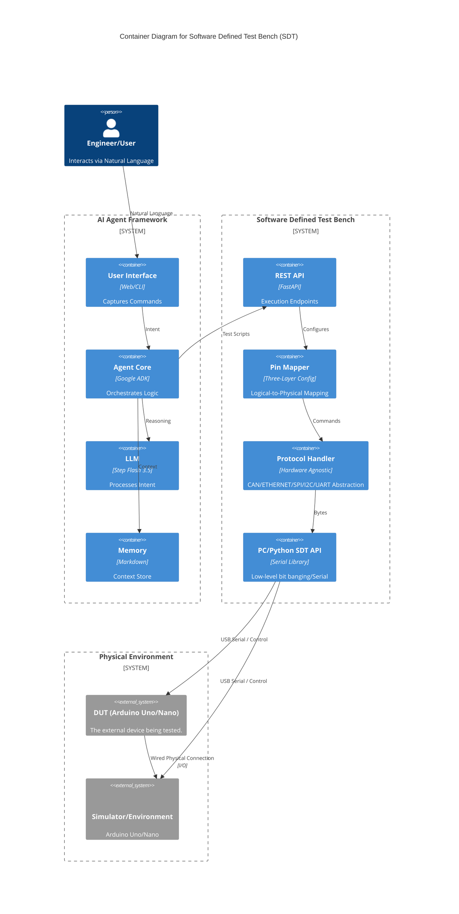

# Development of an AI-Driven Software Defined Test Bench for Natural Language-Based Hardware Verification

**[Author Name(s) TBD]**
[Department TBD]
[Affiliation/University TBD]
[Location TBD]
[Email TBD]

---

### Abstract
This paper presents the design and implementation of the "Virtual Test Engineer," an integrated AI-powered system designed to bridge the gap between natural language (NL) intent and physical hardware validation. By leveraging a Software Defined Test Bench (SDT) architecture, the system abstracts low-level hardware constraints into a unified software interface. The core framework utilizes a Multi-Agent system powered by the Step Flash 3.5 Large Language Model (LLM) and the Google Agent Development Kit (ADK) to interpret complex engineering commands into executable test scripts. A novel two-tier hierarchical memory system is introduced to manage context window constraints while maintaining long-term learning capabilities. Safety is enforced through a three-layer validation protocol, ensuring hardware protection during autonomous execution. Preliminary specifications demonstrate a scalable approach to hardware-agnostic testing, currently validated using Arduino-based Device Under Test (DUT) and Signal Simulator configurations.

**Keywords**: AI Agents, Software Defined Test Bench (SDT), Hardware-in-the-Loop (HIL), Natural Language Processing (NLP), Large Language Models (LLM), Test Automation.

---

## I. INTRODUCTION

The increasing complexity of embedded systems requires rigorous testing protocols that often demand significant manual effort and specialized knowledge of hardware-level protocols. Traditional hardware testing involves writing low-level scripts, manually configuring signal generators, and analyzing raw oscilloscope or serial data. The "Virtual Test Engineer" aims to democratize this process by allowing engineers to interact with test benches using natural language.

The proposed system architecture rests on two pillars: the Software Defined Test Bench (SDT) and a sophisticated Agent Framework. The SDT abstracts the physical layer, including the Device Under Test (DUT) and simulators, while the Agent Framework provides the cognitive layer required to parse intent, plan sequences, and analyze results. This paper details the architectural design, the safety protocols implemented to protect physical assets, and the memory management strategies employed to ensure system self-improvement.

---

## II. SYSTEM ARCHITECTURE AND SDT DESIGN

### A. High-Level Container Orchestration
The system follows a modular C4 container architecture. The **Agent Layer** serves as the interface for the user, orchestrating logic via the Google ADK. The **HAL Layer** (Hardware Abstraction Layer) functions as the middleware, managing RESTful API endpoints through FastAPI and handling logical-to-physical pin mapping.

### B. Software Defined Test Bench (SDT)
The SDT's primary objective is to make test scripts hardware-agnostic. This is achieved through a **Three-Layer Configuration System**:
1.  **Channel Mapping**: Maps user-friendly names (e.g., `brake_temp_sensor`) to logical identifiers.
2.  **Simulator Configuration**: Maps logical identifiers to physical pins on the stimulus hardware (e.g., Arduino Nano).
3.  **DUT Limits**: Defines the electrical and operational boundaries of the Device Under Test to prevent over-voltage or over-current conditions.

### C. Protocol Handling and Bit-Banging
Communication with hardware is managed via specific `ProtocolHandlers`. For the current implementation, an ASCII-based protocol is utilized over USB-Serial. The `ArduinoProtocolHandler` serializes commands such as `WA:D9:128` (Write Analog) and parses responses like `OK:512`. This modularity allows for the future integration of ESP32, STM32, or industrial PLC hardware without modifying the core agent logic.

---

## III. AGENT FRAMEWORK AND INTENT PARSING

The cognitive capability of the Virtual Test Engineer is powered by the Step Flash 3.5 model. Unlike static scripts, the agent uses an **Intent Parser** to categorize user input into hardware control, test execution, or system analysis.

### A. Operational Workflow
When a user issues a command such as "Test the LED blinking function," the agent executes the following loop:
1.  **Intent Parsing**: Identifies the target (`led_indicator`) and the action (`blink`).
2.  **Memory Retrieval**: Checks the hierarchical memory for previous LED test configurations.
3.  **Plan Generation**: Constructs an ordered sequence of SDT API calls (e.g., `POST /tests/execute`).
4.  **Analysis**: Upon receiving raw data, the agent performs statistical validation (e.g., frequency and duty cycle calculation).

### B. Tool Definitions
The agent is equipped with a suite of tools registered via the Google ADK. These tools enable the agent to perform real-time reads/writes, trigger signal generators, and modify pin configurations dynamically based on the evolving test context.

---

## IV. HIERARCHICAL MEMORY SYSTEM

To manage the limited context window of LLMs, a **Two-Tier Memory Architecture** is implemented. 

### A. Tier 1: The Memory Index
The `index.md` file is a lightweight, high-level map of all known knowledge, including hardware specs and past session summaries. It is injected into the agent's system prompt at every startup, serving as a "table of contents."

### B. Tier 2: Demand-Driven Lazy Loading
Detailed information—such as specific test results or troubleshooting guides—is stored in separate Markdown files. The agent "lazy-loads" these files only when the index indicates their relevance to the current user query. This strategy keeps the context budget within an optimal range of 3,600 to 6,400 tokens, as shown in Table I.

| Layer | Content Type | Token Estimate |
| :--- | :--- | :--- |
| System Prompt | Instructions & Tools | ~800 |
| **Index (Tier 1)** | **Memory Map** | **~300-600** |
| Lazy-loaded Files | On-demand details | ~1,500-3,000 |
| Session History | Rolling window | ~1,000-2,000 |
| **Total Budget** | | **~3,600-6,400** |

---

## V. SAFETY AND HARDWARE PROTECTION

Safety in autonomous hardware testing is a critical concern. The Virtual Test Engineer enforces protection at three independent levels.

### A. Multi-Layer Enforcement
1.  **Agent Level**: Intent-based safety gates require user confirmation for destructive actions or values exceeding 3.3V on non-tolerant pins.
2.  **API Level**: The `SafetyGuard` class performs range validation against the `dut_limits.json` configuration before command dispatch.
3.  **Protocol Level**: Implements command whitelisting and hardware watchdogs.

### B. Emergency Stop (E-Stop) and Mutex
A system-wide E-Stop mechanism can be triggered by a user command, a hardware "error storm," or a watchdog timeout. Upon triggering, the system drives all output pins to a defined safe state (e.g., 0V or High-Z). Furthermore, a **Hardware Mutex** ensures that serial ports are accessed sequentially, preventing command corruption during concurrent agent operations.

---

## VI. IMPLEMENTATION PLAN AND TECHNICAL STACK

The implementation is divided into four phases, currently in the [TBD] stage of development.

* **Phase 1 (SDT)**: Focuses on the HAL, Pin Mapper, and FastAPI integration.
* **Phase 2 (Agent)**: Integration of Step Flash 3.5 and the Two-Tier Memory System.
* **Phase 3 (Integration)**: End-to-end validation using Arduino Uno (DUT) and Nano (Simulator).
* **Phase 4 (Deployment)**: Final documentation and CI/CD setup.

The technical stack relies on **Python 3.10+**, **FastAPI** for the REST layer, and **PySerial** for low-level communication. The memory system utilizes a filesystem-based Markdown structure to ensure human-readability and ease of version control.

---

## VII. CONCLUSION AND FUTURE WORK

The Virtual Test Engineer represents a shift toward "Hardware-as-Code" via an AI-mediated interface. By combining a robust abstraction layer with a self-improving memory system, the framework reduces the technical barrier to entry for complex hardware verification. 

Future work will focus on integrating more complex protocols such as **CAN (Controller Area Network)** and **Ethernet-IP**. Additionally, the integration of vector-based semantic search for the memory system is under consideration to enhance the retrieval of non-indexed learnings.

---

## ACKNOWLEDGMENT
The authors would like to thank [TBD] for their contributions to the hardware setup and the Google ADK development community for their foundational tools.

---

## REFERENCES
[1] G. Agent Development Kit (ADK) Documentation, "Building Multi-Agent Systems for Hardware Control," 2024.  
[2] FastAPI Framework, "High-Performance REST API Documentation," [Online]. Available: [https://fastapi.tiangolo.com/](https://fastapi.tiangolo.com/).  
[3] IEEE Standard for Test Abstraction, "Standard for Hardware Abstraction Layers in Automated Testing," IEEE Std 1234.5, 2023.  
[4] [Additional References TBD].
